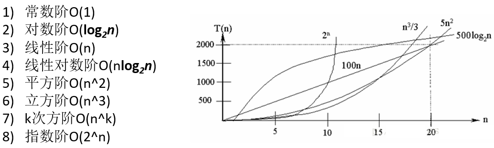
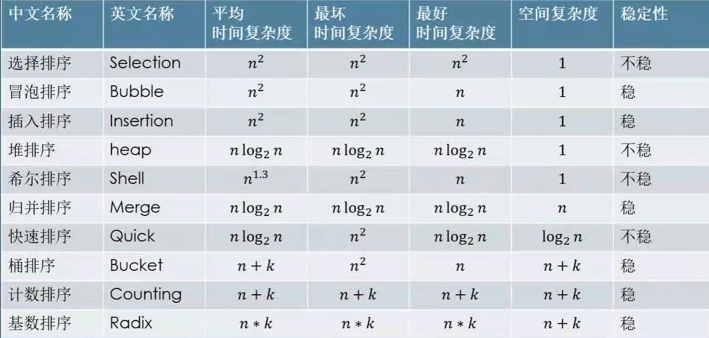
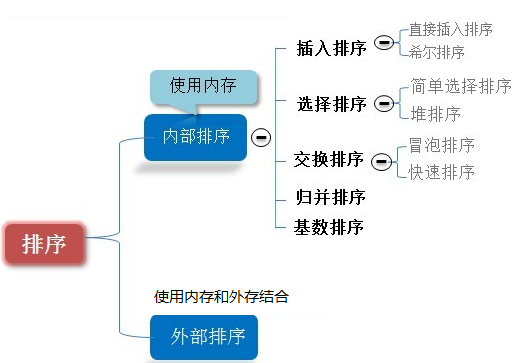

__算法（Algorithm）是指解题方案的准确而完整的描述，算法代表着用系统的方法描述解决问题的策略机制。__算法可大致分为基本算法、数据结构的算法、[数论](https://baike.baidu.com/item/数论)与代数算法、计算几何的算法、[图论](https://baike.baidu.com/item/图论)的算法、[动态规划](https://baike.baidu.com/item/动态规划)以及[数值分析](https://baike.baidu.com/item/数值分析)、[加密算法](https://baike.baidu.com/item/加密算法)、[排序算法](https://baike.baidu.com/item/排序算法)、检索算法、随机化算法、并行算法，厄米变形模型，随机森林算法。


## 一、基本概念

### 1.1、特征

- **有穷性（Finiteness）**

  算法的有穷性是指算法必须能在执行有限个步骤之后终止

- **确切性（Definiteness）**

  算法的每一步骤必须有确切的定义

- **输入项（Input）**

  一个算法有0个或多个输入，以刻画运算对象的初始情况，所谓0个输入是指算法本身定出了初始条件

- **输出项（Output）**

  一个算法有一个或多个输出，以反映对输入数据加工后的结果。没有输出的算法是毫无意义的

- **可行性（Effectiveness）**

  算法中执行的任何计算步骤都是可以被分解为基本的可执行的操作步，即每个计算步都可以在有限时间内完成（也称之为有效性）。


### 1.2、评定

同一问题可用不同算法解决，而一个算法的质量优劣将影响到算法乃至程序的效率。[算法分析](https://baike.baidu.com/item/算法分析)的目的在于选择合适算法和改进算法。一个算法的评价主要从[**时间复杂度**](https://baike.baidu.com/item/时间复杂度)和[**空间复杂度**](https://baike.baidu.com/item/空间复杂度)来考虑。

- 时间复杂度
  1. 忽略常数项
  2. 忽略低次项
  3. 忽略系数

- 空间复杂度

  一般不考虑，更注重时间复杂度。**缓存产品的本质就是以空间换时间**。

- 常见的时间复杂度




### 1.3、方法

1. [递推法](https://baike.baidu.com/item/%E7%AE%97%E6%B3%95/209025?fr=aladdin#4_1)
2. [递归法](https://baike.baidu.com/item/%E7%AE%97%E6%B3%95/209025?fr=aladdin#4_2)
3. [穷举法](https://baike.baidu.com/item/%E7%AE%97%E6%B3%95/209025?fr=aladdin#4_3)
4. [贪心算法](https://baike.baidu.com/item/%E7%AE%97%E6%B3%95/209025?fr=aladdin#4_4)
5. [分治法](https://baike.baidu.com/item/%E7%AE%97%E6%B3%95/209025?fr=aladdin#4_5)
6. [动态规划法](https://baike.baidu.com/item/%E7%AE%97%E6%B3%95/209025?fr=aladdin#4_6)
7. [迭代法](https://baike.baidu.com/item/%E7%AE%97%E6%B3%95/209025?fr=aladdin#4_7)
8. [分支界限法](https://baike.baidu.com/item/%E7%AE%97%E6%B3%95/209025?fr=aladdin#4_8)
9. [回溯法](https://baike.baidu.com/item/%E7%AE%97%E6%B3%95/209025?fr=aladdin#4_9)


## 二、排序

### 2.1、概述：

​	排序是将一组数据，依指定的顺序进行排列的过程。



### 2.2、排序的分类：

1. 内部排序:

   指将需要处理的所有数据都加载到内部存储器中进行排序。

2. 外部排序法：

   数据量过大，无法全部加载到内存中，需要借助外部存储进行排序。

3. **常见的排序算法分类:**




### 2.3、冒泡排序

```java
	public static void bubbleSort(int[] arr) {
        for (int i = 0;i < arr.length-1;i++) {
            for (int j = 0;j < arr.length-i-1;j++) {
                if (arr[j] > arr[j+1]) {
                    int temp = arr[j];
                    arr[j] = arr[j+1];
                    arr[j+1] = temp;
                }
            }
        }
    }
```


### 2.4、选择排序

```java
	public static void selectSort(int[] arr) {
        for (int i = 0; i < arr.length-1; i++) {
            int min = i;
            for (int j = i; j < arr.length-1; j++) {
                if (arr[min] > arr[j+1]) {
                    min = j+1;
                }
            }
            if (min != i) {
                int temp = arr[i];
                arr[i] = arr[min];
                arr[min] = temp;
            }
        }
    }
```


### 2.5、插入排序

```java
	public static void insertSort(int[] arr) {
        for (int i = 1; i < arr.length; i++) {
            int tempValue = arr[i];
            int tempIndex = i-1;
            while (tempIndex >= 0 && tempValue < arr[tempIndex]) {
                arr[tempIndex + 1] = arr[tempIndex];
                tempIndex--;
            }
            arr[tempIndex+1] = tempValue;
        }
    }
```


### 2.6、希尔排序

```java
	public static void shellSort(int[] arr) {
        for (int gap= arr.length/2; gap > 0; gap /= 2) {
            for (int i = gap; i < arr.length; i+=gap) {
                int Value = arr[i];
                int Index = i-gap;
                while (Index >= 0 && Value < arr[Index]) {
                    arr[Index + gap] = arr[Index];
                    Index--;
                }
                arr[Index+gap] = Value;
            }
        }
    }
```


### 2.7、快速排序

```java
	public static void quickSort(int[] arr,int left,int right) {
        if (left > right) return;
        int mid = partition(arr,left,right);
        quickSort(arr,left,mid-1);
        quickSort(arr,mid+1,right);
    }

    private static int partition(int[] arr,int left,int right) {
        int l = left;
        int r = right;
        int pivot = arr[right];
        while (l < r) {
            while (l < r && arr[l] < pivot) l++;
            while (l < r && arr[r] >= pivot) r--;

            if (l < r) {
                int temp = arr[l];
                arr[l] = arr[r];
                arr[r] = temp;
            }
        }
        if (arr[r] > pivot) {
            arr[right] = arr[r];
            arr[r] = pivot;
        }
        return r;
    }
```


### 2.8、归并排序

```java
	public static void mergeSort(int[] arr,int left,int right,int[] temp) {
        if (left == right) return;

        int mid = (left + right)/2;
        mergeSort(arr,left,mid,temp);
        mergeSort(arr,mid+1,right,temp);
        merge(arr,left,mid+1,right,temp);
    }

    public static void merge(int[] arr,int left,int mid,int right,int[] temp) {
        int i = left;
        int j = mid;
        int k = 0;

        while (i<mid && j<=right) {
            temp[k++] = arr[i] <= arr[j] ? arr[i++] : arr[j++];
        }

        while (i < mid)temp[k++] = arr[i++];
        while (j <= right)temp[k++] = arr[j++];


        for (int m = 0; m < right-left+1; m++) arr[left+m] = temp[m];
    }
```


### 2.9、基数排序

```java
	public static void radixSort(int[] arr) {
        int[][] bucket = new int[10][arr.length];
        
        int max = arr[0];
        for (int i = 1; i < arr.length; i++) {
            if (arr[i]>max) max = arr[i];
        }

        for (int i = 0; i < String.valueOf(max).length(); i++) {
            int[] bucketCount = new int[10];
            
            for (int j = 0; j < arr.length; j++) {
                int digit = (int)(arr[j]/(Math.pow(10,i))%10);
                bucket[digit][bucketCount[digit]] = arr[j];
                bucketCount[digit]++;
            }

            int index = 0;
            for (int k = 0; k < bucketCount.length; k++) {
                for (int g = 0; g < bucketCount[k]; g++) {
                    arr[index++] = bucket[k][g];
                }
            }

        }
    }
```


## 三、查找

### 3.1、常用的查找算法

1. 顺序（线性）查找
2. 二分查找
3. 插值查找
4. 斐波那契查找

### 3.2、顺序查找

* __要求__：_无_
* __定义__：_逐一比对，相等则返回_

### 3.3、二分查找

* __要求__：_数组有序_
* __定义__：

### 3.4、插值查找


### 3.5、斐波那契查找

