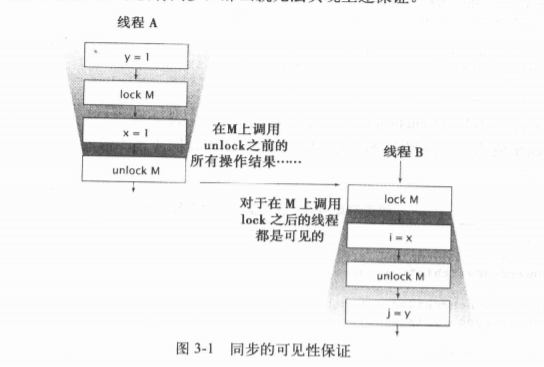

## 第一章    简介

### 1、并发的历史背景

​	由 **资源利用率**、**公平性**，**便利性** 等原因

### 2、线程的优势

* 发挥多处理器的强大能力
* 建模的简单些
* 异步事件的简化处理
* 更灵敏的用户界面

### 3、线程带来的风险

* 线程安全问题

* 活跃性

  一个并发应用程序及时执行的能力称为活跃性，常见活跃性问题**死锁**。

* 性能问题

  指线程调度切换、保存和恢复执行上下文、抑制编译器优化、使内存缓存数据无效

# 第一部分    基础知识

## 第二章    线程安全

### 1、什么是线程安全？

​	当多个线程访问某个类，始终表现出正确的行为，那么就称这个类是线程安全的。

### 2、原子性

​	内置锁以原子的方式执行符合操作

### 3、重入

​	意味着锁的粒度是线程，而不是调用

## 第三章    对象的共享

> synchronized 除了能用于实现原子性或者 **“临界区（Critical Section）”**，还有另一个重要方面：**内存可见性（Memory Visibility）**

### 1、可见性

​	内存可见性（Memory Visibility），当一个线程修改对象状态后，其它线程能够看到发生的变化，两种实现方式：**内置锁**、**Volatile 变量**

* 内置锁

* **Volatile 变量**：Java虚拟机提供的轻量级同步机制

### 2、发布与溢出

​	**发布：** 使对象能够在当前作用域之外使用

​	**溢出：** 指意料之外或尚未构造完成的发布

### 3、 线程封闭

> 指的是将数据封闭在线程内，也是实现线程安全的方式之一。线程封闭的三种实现方式：

* **Ad-hoc 线程封闭**：是指维护线程封闭性的职责完全由程序实现来承担。非常脆弱，没有语言特性
* **栈封闭**：只能通过局部变量访问对象。
* **ThreadLocal 类**：使线程中的某个值与保存值的对象关联起来。推荐使用。

 ### 4、不变性

> 不可变对象一定是线程安全的。

* 不可变对象特点：
  1. 对象正确创建（在创建期间，this 引用没有溢出）
  2. 创建后不能修改
  3. 且所以域都是 final 类型
* Final 域：能够确保初始化过程的安全性

### 5、安全发布

安全发布的常用模式：

1. 在静态初始化函数中初始化一个对象引用
2. 将对象的引用保存到 volatile 类型的域或 AtomicReferance 对象中
3. 将对象的引用保存到某个正确构造对象的 final 类型域中
4. 将对象的引用保存到一个由锁保护的域中

## 第四章    对象的组合

### 1、设计线程安全的类

线程安全类的三个基本要素：

1. 找出构成对象状态的所以变量
2. 找出约束状态变量的不变性条件
3. 建立对象状态的并发访问管理策略

### 2、实力封闭

将数据封装在对象内部，将数据的访问限制在对象的方法上，从而更容易确保访问数据总能持有正确的锁

### 3、线程安全性的委托

可以将对象的域的线程安全性委托给已实现的安全容器类

### 4、在现有安全类添加功能

 通过 **组合模式** 实现

