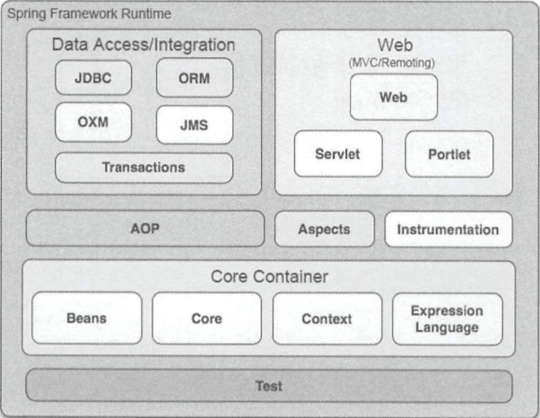
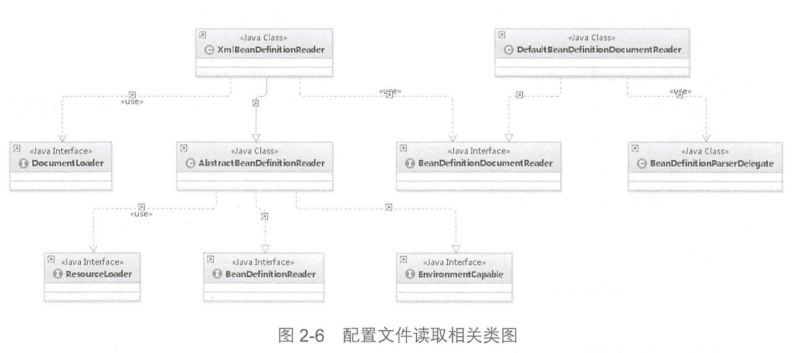
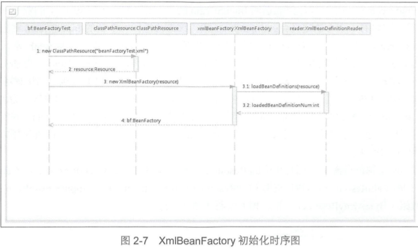
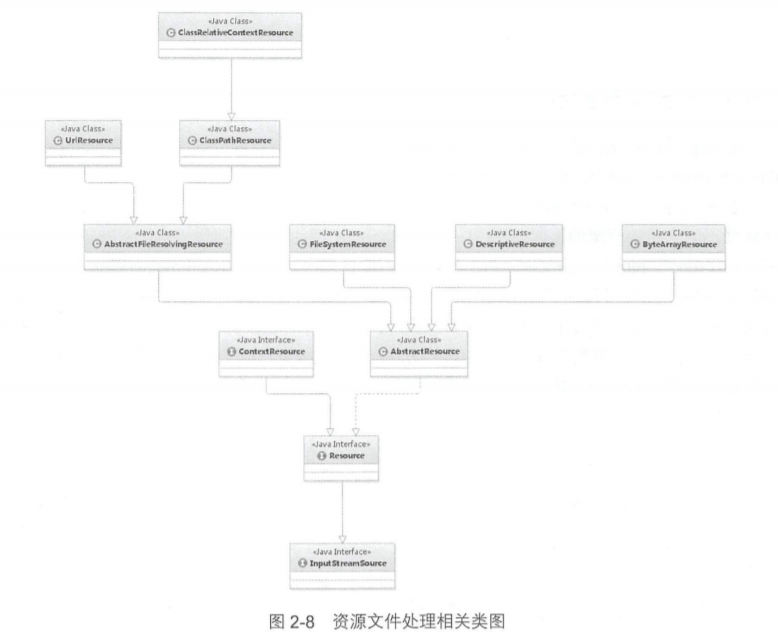

# 第 1 章	Spring 整体架构及环境搭建

### 1.1	Spring 的整体架构




# 第 2 章	容器的基本实现

### 2.2	功能分析

容器实现的基本步骤：

* 读取配置文件。

* 根据配置文件中的配置找到对应的类的配置，并实例化。

* 调用实例化后的实例。

  

### 2.4.2	核心类介绍

1、DefaultlistableBeanFactory 

> XmlBeanFactory 继承自 DefaultListableBeanFactory，而 DefaultListableBeanFactory 是整个 bean
> 加载的核心部分，是 Spring 注册及加载 bean 的默认实现，而对于 XmlBeanFactory 与
> DefaultListableBeanFactory 不同的地方其实是在 XmlBeanFactory 中使用了自定义的 XML 读取器
> XmlBeanDefinitionReader，实现了个性化的 BeanDefinitionReader 读取，DefaultListableBeanFactory
> 继承了 AbstractAutowireCapableBeanFactory 并实现了 ConfigurableListableBeanFactory 以及
> BeanDefinitionRegistry 接口。

2、XmlBeanDefinitionReader

> XML 配置文件的读取是 Spring 中重要的功能 ，因为 Spring 的大部分功能都是以配置作为
> 切入点的，那么我们可以从 XmlBeanDefinitionReader 中梳理一下资源文件读取、解析及注册的
> 大致脉络。




### 2.5	容器的基础 XmlBeanFactory

```java
BeanFactory bf = new XmlBeanFactory(new ClassPathResource("beanFactoryTest.xml"));
```



### 2.5.1	配置文件封装

Spring 的配置文件读取是通过 ClassPathResource 行封装的，如

```java
new ClassPathResource("beanFactory Test.xml")
```

对不同来源的资源文件都有相应的 Resource 实现：文件（FileSystemResource）、 Class path资源（ ClassPathResource）、 URL 资源（UrlResource）、InputStream 资源（InputStreamResource）、
Byte 数组（ ByteArrayResource ）等



将封装为 Resouree 类型的实例后，XmlBeanFactory 的初始化过程

```java
@Deprecated
public class XmlBeanFactory extends DefaultListableBeanFactory {
    private final XmlBeanDefinitionReader reader;

    public XmlBeanFactory(Resource resource) throws BeansException {
        // 调用 XmlBeanFactory(Resource, BeanFactory）构选方法
        this(resource, (BeanFactory)null);
    }

    public XmlBeanFactory(Resource resource, BeanFactory parentBeanFactory) throws BeansException {
        super(parentBeanFactory);// 调用父类构造
        this.reader = new XmlBeanDefinitionReader(this);
        this.reader.loadBeanDefinitions(resource);// 读取
    }
}
```

跟踪代码到父类 AbstractAutowireCapableBeanFactory 的构造，ignoreDependencyInterface 的主要功能是
忽略给定接口的自动装配功能


### 2.5.2	加载 Bean

**根据 this .reader. loadBeanDefinitions(resource) 梳理主要流程：**

* **封装资源文件。**当进入 XrnlBeanDefinitionReader 后首先对参数 Resource 使用EncodedResource 类进行封装。

* **获取输入流。**从 Resource 中获取对应的 InputStrearn 并构造 lnputSource。

* **通过构造的 InputSource 实例和 Resource 实例继续调用函数 doLoadBeanDefinitions。**

**doLoadBeanDefinitions 函数主要干了三件事情：**

* 加载 XML 文件的验证模式。
* 加载 XML 文件，并得到对应的 Document。
* 根据返回的 Document 注册 Bean 信息。_(尤其复杂)_


### 2.6	获取 XML 的验证方式

