## 第一章    网络基础知识


### 1.1、分组交换

> 在通信过程中，通信双方以分组为单位、使用存储-转发机制实现数据交互的通信方式，被称为分组交换（PS:packet switching）。

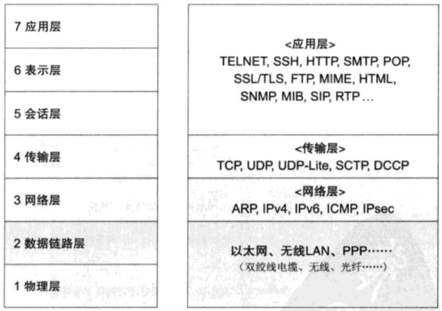

### 1.2、传输的方式

* **面向有连接型**

  > 在发送数据之前，需要在收发主机之间连接一条通信线路。

  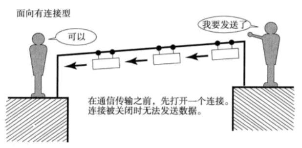

* **面向无连接型**

  > 发送端不需要建立和断开连接，发送端可于任何时候自由发送数据。接收端不知道何时从何地收到数据，因此需要时常确认是否收到数据。

  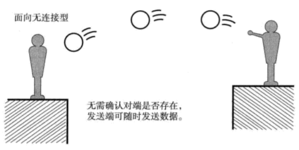

### 1.3、单播，广播，多播，任播

> 网络通讯中根据客户端数量的一种分类

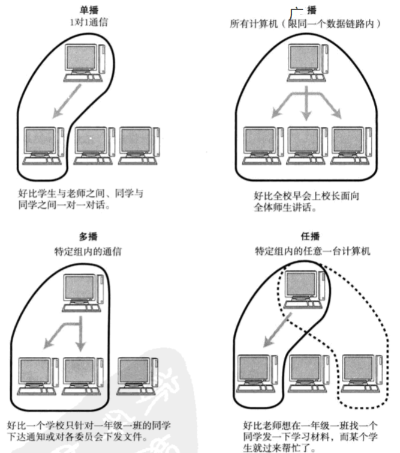


### 1.4、地址

> 通信传输中，发送端和接收端可以被视为通信的主体。它们都能以一个所谓 “地址” 的信息加以标识起来。例如电话中号码就相当于 “地址”。

特性：

1. 唯一性
2. 层次性


### 1.5、网络构成的要素

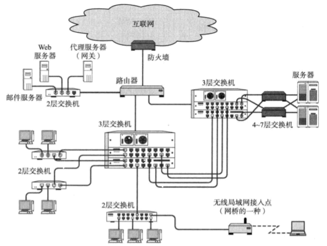

| 设备                       | 作用                                    |
| :------------------------- | :-------------------------------------- |
| 网卡                       | 使计算机连网的设备（Network Interface） |
| 中继器（Repeater）         | 从物理层上延长网络的设备                |
| 网桥（Bridge）/2层交换机   | 从数据链路层延长网路的设备              |
| 路由器（Router）/3层交换机 | 通过网络层转发分组数据的设备            |
| 4 ~ 7 层交换机             | 处理传输层以上各层网络传输的设备        |
| 网关（Gateway）            | 转换协议的设备                          |


## 第二章    TCP/IP基础知识

### 2.1、背景及历史

> 由美国国防部主导，希望在通信传输的过程中，即使某些节点被攻击或破坏，也可以经过迂回路线实现最终通信。

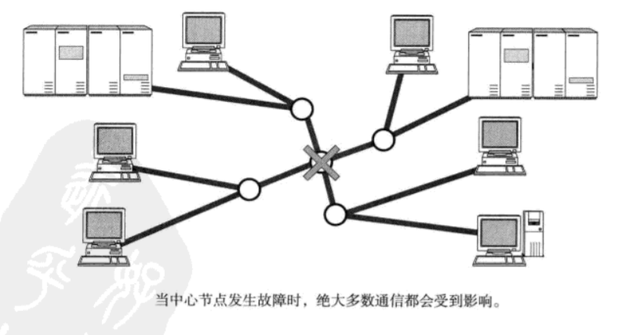

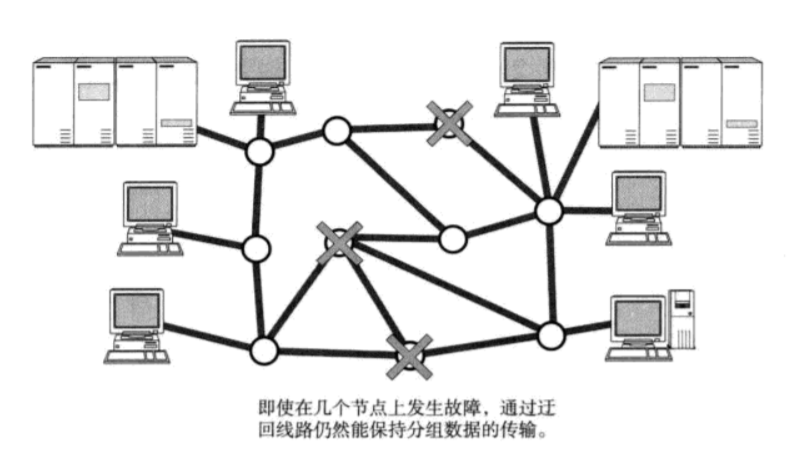


### 2.2、TCP/IP 的具体含义

> TCP/IP 并不只限于 TCP 与 IP 两种协议。具体来说，IP 或 ICMP、TCP 或 UDP、TELNET 或 FTP、以及 HTTP 等都是属于 TCP/IP协议。

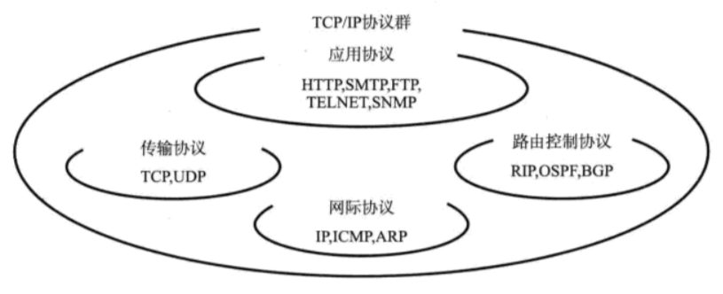

### 2.3、TCP/IP 与 OSI 参考模型

**开放式系统互联（OSI）**

> **开放系统互联(Open System Interconnection)**意为开放式系统互联，把[网络通信](https://baike.baidu.com/item/网络通信)的工作分为7层,分别是[物理层](https://baike.baidu.com/item/物理层),[数据链路层](https://baike.baidu.com/item/数据链路层),[网络层](https://baike.baidu.com/item/网络层),[传输层](https://baike.baidu.com/item/传输层),会话层,[表示层](https://baike.baidu.com/item/表示层)和[应用层](https://baike.baidu.com/item/应用层)。

**TCP/IP协议**

> TCP/IP（Transmission Control Protocol/Internet Protocol，传输控制协议/网际协议）是指能够在多个不同网络间实现信息传输的协议簇。TCP/IP协议不仅仅指的是[TCP](https://baike.baidu.com/item/TCP/33012) 和[IP](https://baike.baidu.com/item/IP/224599)两个协议，而是指一个由[FTP](https://baike.baidu.com/item/FTP/13839)、[SMTP](https://baike.baidu.com/item/SMTP/175887)、TCP、[UDP](https://baike.baidu.com/item/UDP/571511)、IP等协议构成的协议簇， 只是因为在TCP/IP协议中TCP协议和IP协议最具代表性，所以被称为TCP/IP协议。

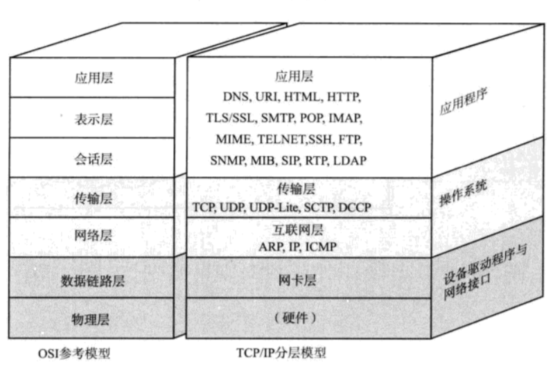

#### 物理层（硬件）

> TCP/IP 的最底层是负责数据传输的硬件。如以太网、无线LAN、PPP等。


#### 网络接口层（数据链路层）

> 网络接口层利用以太网中的数据链路层进行通信，因此属于接口层。类似驱动的概念。


#### 互联网层（网络层）

> 主要作用是实现终端节点之间的通信，是TCP/IP 的心脏，由 IP（Internet Protocol）、 ICMP（Internet Control Message Protocol）、ARP（Address Resolution Protocol）等协议组成。

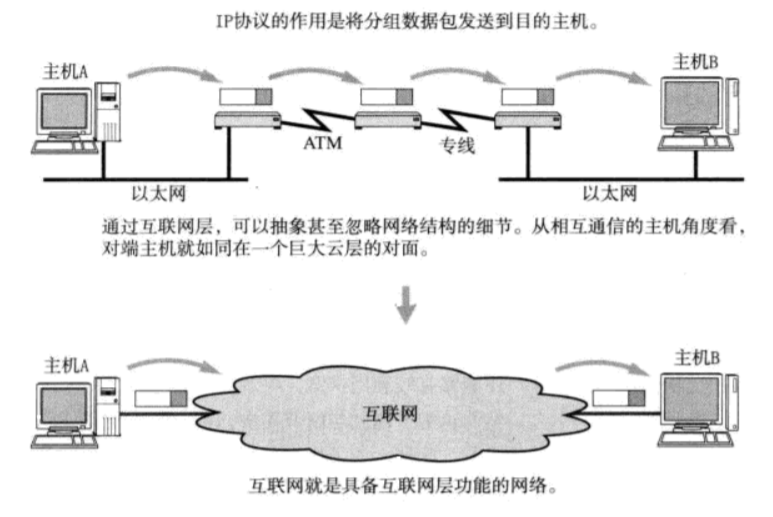

* **IP**

  IP 是跨网络传送数据包，使整个互联网都能收到数据的协议。IP 协议使数据能够发送到另一端。

  IP还隐含着数据链路层的功能。

  IP不具有重发机制。

* **ICMP**

  IP 数据包在发送途中一旦发生异常导致无法到达对端目标地址时，需要发送端发送一个发生异常的通知。ICMP就是为这一功能定制的。它有时也被用来诊断网络的健康状况。

* **ARP**

  从分组数据包的 IP 地址中解析出物理地址（MAC 地址）的一种协议

#### 传输层

> 传输层主要的功能就是让程序间实现通信。计算机内部，通常运行多个程序，因此以**端口号**与哪个应用通信

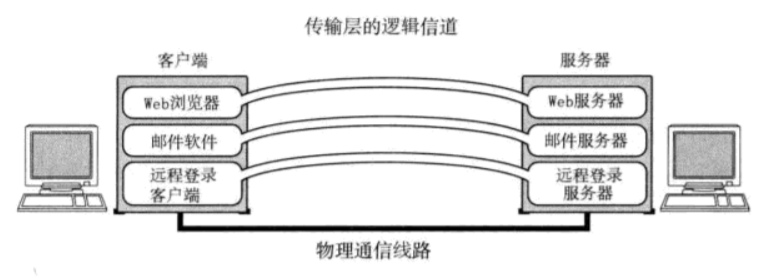

* **TCP**
  1. 传输控制协议（TCP，Transmission Control Protocol）是一种面向连接的、可靠的、基于字节流的传输层通信协议，由IETF的RFC 793 [1] 定义。
  2. 通过检验、序列号、确认应答、重发控制、连接管理以及窗口控制等机制实现可靠性传输
  3. 网络开销大，建立与断开连接有时至少需要 7 次以上的收发包
* **UDP**
  1. 面向无连接的传输层协议
  2. 实时性较好，网络开销小
  3. 可靠性差，不对数据报进行检查与修改，所以会出现分组丢失、重复、乱序，应用程序需要负责传输可靠性方面的所有工作


#### 应用层（会话层以上的分层）

* **HTTP**

  http 是一个简单请求-响应协议，它通常运行在 TCP 之上。

* **MIME**

  用于电子邮件

* **FTP**

  文件传输

* **TELNET 与 SSH**

  远程登陆

* **SNMP**

  网络管理


### 2.4、分层模型与通信实例

> 每个分层都会对发送的数据附加一个首部，首部中包含了该层必要的信息，如发送的目标地址以及协议相关信息

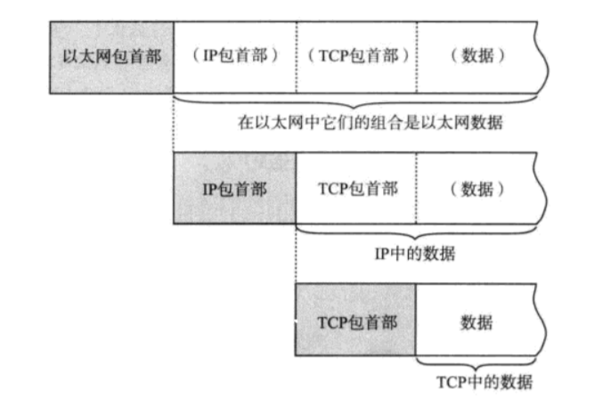

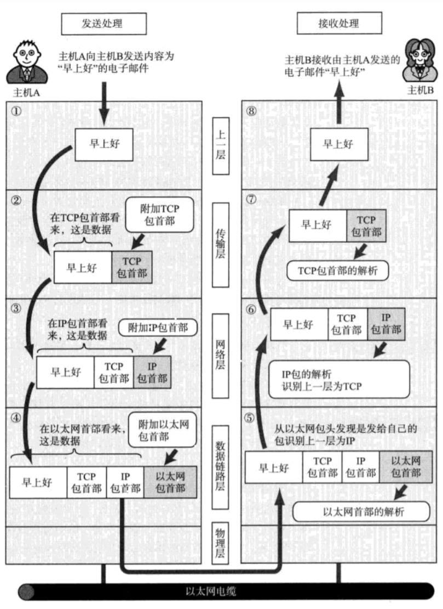

* **经过数据链路的包**

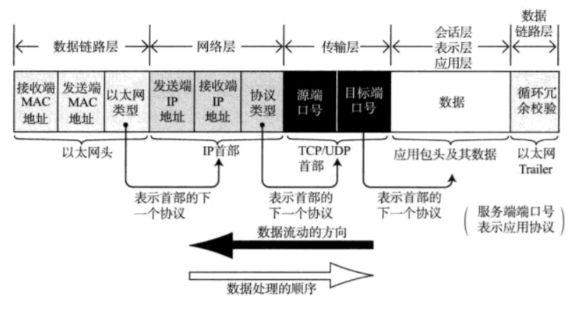

### 2.5、数据的单位

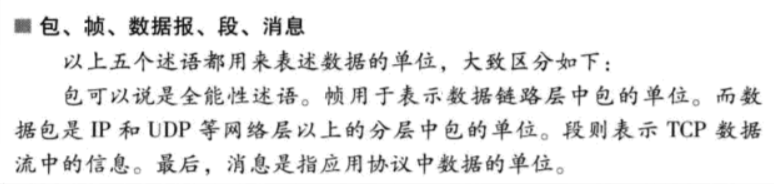


## 第三章    数据链路

### 3.1、相关技术

* **网络拓扑**

  网络的连接和构成形状称为网络拓扑（Topology）。主要包括总线型、环形、星型、网状型等。

  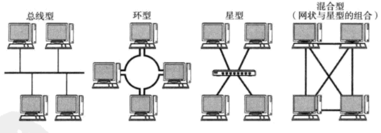

* **MAC 地址**

  MAC 地址用于识别数据链路中互连的节点，长度48比特。

  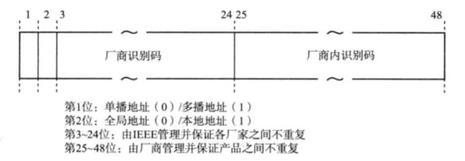

* **共享介质型网络**

  共享介质型网络指由多个设备共享一个通信介质的一种网络。其中又分两种控制方式：

  1. **争用**，是指争夺数据传输的权力，也叫 CSMA（载波监听多路访问）。
  2. **令牌传递**，是沿着令牌环路发送一种叫做 “令牌” 的特殊保温，是控制传输的一种。

* **非共享介质网络**

  非共享介质网络是指不共享介质，网络中每个站直连交换机，即星型拓扑

* **半双工通信与全双工通信**

  半双工是指只发送或指接收的通信方式。他类似无线电收发器，若两端同事说话，是听不清对方的话的。而全双工通信可以在同一时间收发数据。

* **根据 MAC 地址转发**

  以太网交换机接到包时，从源 MAC 地址作以及曾经接收该地址发送数据包的接口作为对应关系生成**转发表（Forwarding Table）**，根据此表发送数据到对应网络接口。

* **交换机转发方式**

  1. 存储转发，是检查以太网数据帧末尾的 FCS 位后再进行转发。可以避免因冲突而被破坏的帧或噪音导致的错误帧
  2. 直通转发

* **环路检测技术**

  所有环路的形成都是由于目的路径不明确导致混乱而造成的，具体有以下两种解决方式：

  1. 生成树方式
  2. 源路由法

* **VLAN**

  虚拟局域网（VLAN）是一组逻辑上的设备和用户，这些设备和用户并不受物理位置的限制，可以根据功能、部门及应用等因素将它们组织起来，相互之间的通信就好像它们在[同一个网段](https://baike.baidu.com/item/同一个网段/10612240)中一样，由此得名虚拟局域网。


### 3.2、以太网


## 第四章    IP 协议

### 4.1、IP 基础知识

> IP 大致分为三大作用模块，IP 寻址、路由、IP 分包与组包。

* IP 地址属于网络层地址  


### 4.2、全局地址与私有地址

> 全局地址就是公网ip，其它均为私有地址。配合上 NAT（Network Address Translation，网络地址转换）技术解决 IP 地址不足问题

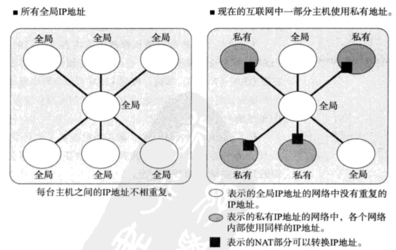


## 第五章    TCP

### 5.1、TCP头信息

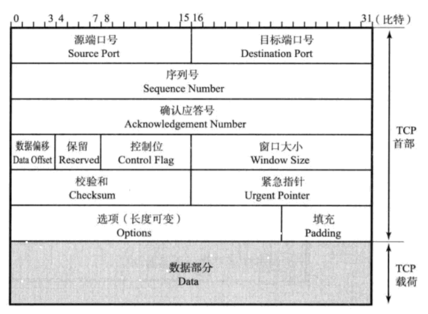

* **源端口号（Source Port）**

  表示发送端端口号，字段长16位。

* **目标端口号（Destination Port）**

  表示发送端断后，字段长16位。

* **序列号（Sequence Number）**

  表示发送数据的位置，字段长32位。每发送一次数据，就累加该数据字节数。

  序列号不从 0 或 1 开始，而是建立连接时由计算机生成随机数作为其初始值，通过 SNY 包传给接收端机器

* **确认应答号（Acknowledgment Number）**

  表示下一次应该收到的数据序列号，字段长32位。

* **数据偏移（Data Offset）**

  表示数据开始位置，字段长4位。也可以认为是首部长度。

* **保留（Reserved）**

  扩展使用，长度4，一般为0。

* **控制位（Control Flag）**

  字段长8位，从左至右分别为 CWR、ECE、URG、ACK、PSH、RST、SYN、FIN。对应位为1表示启用

* **窗口大小（Window Size）**

  TCP 发送数据的段大小，为 0 则发送窗口探测，长度16位。 

* **校验和（Checksum）**

  与UDP的校验和类似，用于校验目的地一组[数据项](https://baike.baidu.com/item/数据项/3227309)的和。区别在于 TCP 的校验和无法关闭。

* **紧急指针（Urgent Pointer）**

  表示本报文段中紧急数据的指针，只有在 URG 控制位为 1 时有效。长度16

* **选项（Options）**

  提高传输性能


### 5.2、可靠传输相关机制

> 通过 IP 数据报实现可靠传输，需考虑如**数据的破环、丢包、重复、以及分片混乱**等问题，TCP通过**校验和、序列号、确认应答、重发控制、连接管理、以及窗口控制**等实现可靠传输。

* **TCP 以段为单位发送数据**

  在**建立 TCP 连接的同时**，会确定发送数据包的单位，称其为“最大消息长度”（MSS：Maximum Segment Size）。理想情况 MSS 小于 IP 的最大传输单元（MTU）
  
* **通过序列号与确认应答提高可靠性**

  ```mermaid
  sequenceDiagram
  	participant A as 主机A
      participant B as 主机B
      A ->> B: 数据（1 ~ 1000）
      B ->> A: 确认应答（下一个是1001）
      A ->> B: 数据（1001 ~ 2000）
      B ->> A: 确认应答（下一个是2001）
  ```

* **连接管理**

  ```mermaid
  sequenceDiagram
  	participant A as 主机A（客户端）
      participant B as 主机B（服务端）
      opt 建立连接
  	A->>B: SYN（请求建立连接）
  
  	B->>A: ACK（针对SYN的确认应答）SYN
  	A->>B: ACK
  	note right of B: 消息长度取首部mss
  	end
  	note over A,B: 连接建立完成，发送数据
  	opt 断开连接
  	A->>B: FIN（请求切断连接）
  	B->>A: ACK（针对FIN的确认应答）
  	B->>A: FIN
  	A->>B: ACK
  	end
  ```

* **利用窗口控制提高速度**

  同时发送多个段，段的个数就是窗口大小

* **窗口控制与重发控制**

  这里不采用超时重发机制，通过下一个确认应答确认。如果收到3个同样的确认应答，则认为报文段丢失，进行重发，否则认为确认应答丢失，不重发

* **流控制**

  根据确认应答的 “窗口大小” 字段调整发送数据段的量

* **拥塞控制**

  在通信一开始通过**慢启动算法**得出的数值，对发送的数据量进行控制。

* **提高网络利用率的规范**

  1. Nagle 算法
  2. 确认延迟应答
  3. 捎带应答


## 第六章    UDP

> UDP 是 User Datagram Protocol 的缩写。不提供复杂的控制机制，利用 IP 提供面向无连接的通信服务。常用于：
>
> * 包总量较少的通信（DNS、SNAMP等）
> * 视频、音频、等多媒体通信（即时通讯）
> * 限定于 LAN 等特定网络中的应用通信
> * 广播通信（广播、多播）


#### 6.1、UDP 首部格式

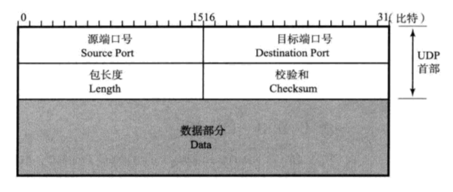

* **源端口号（Source Port）**

  表示发送端端口号，字段长16位。该字段可选，用于不需要返回的通讯中，没有则值为0。

* **目标端口号（Destination Port）**

  表示发送端断后，字段长16位。

* **包长度（Length）**

  该字段保存了 UDP 首部的长度跟数据的长度之和。单位为字节（8 位字节）。

* **校验和（Checksum）**

  校验和是为了提供可靠的 UDP 首部和数据而设计，用于校验目的地一组[数据项](https://baike.baidu.com/item/数据项/3227309)的和。通常以十六进制为数制表示，如果校验和的数值超过十六进制的FF，也就是255. 就要求其补码作为校验和。


