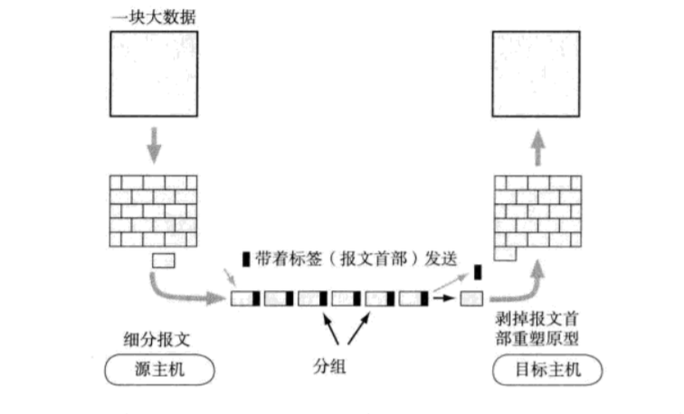
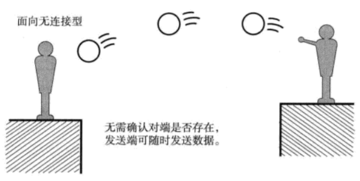
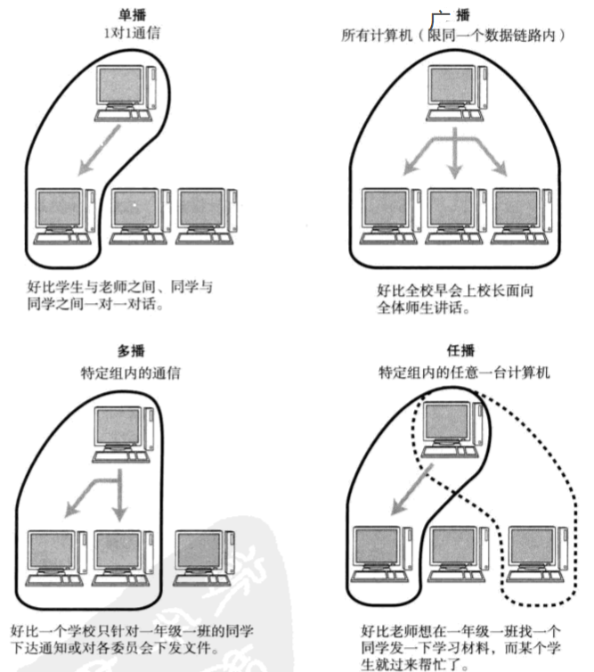
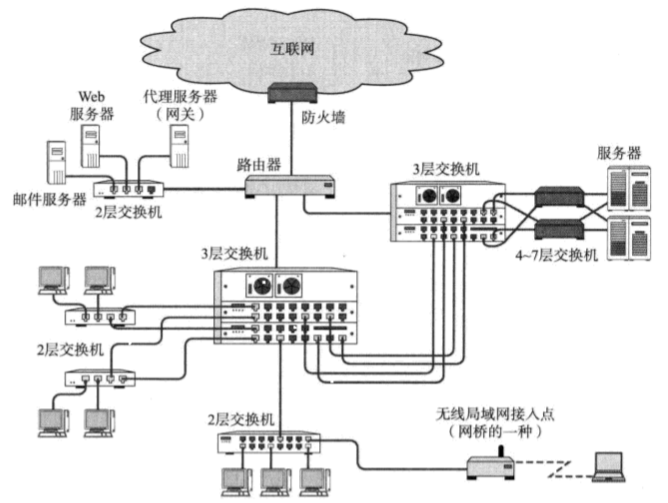

## 第一章    网络基础知识

### 1.1、网络模型

**开放式系统互联（OSI）**

> **开放系统互联(Open System Interconnection)**意为开放式系统互联，把[网络通信](https://baike.baidu.com/item/网络通信)的工作分为7层,分别是[物理层](https://baike.baidu.com/item/物理层),[数据链路层](https://baike.baidu.com/item/数据链路层),[网络层](https://baike.baidu.com/item/网络层),[传输层](https://baike.baidu.com/item/传输层),会话层,[表示层](https://baike.baidu.com/item/表示层)和[应用层](https://baike.baidu.com/item/应用层)。

**TCP/IP协议**

> TCP/IP（Transmission Control Protocol/Internet Protocol，传输控制协议/网际协议）是指能够在多个不同网络间实现信息传输的协议簇。TCP/IP协议不仅仅指的是[TCP](https://baike.baidu.com/item/TCP/33012) 和[IP](https://baike.baidu.com/item/IP/224599)两个协议，而是指一个由[FTP](https://baike.baidu.com/item/FTP/13839)、[SMTP](https://baike.baidu.com/item/SMTP/175887)、TCP、[UDP](https://baike.baidu.com/item/UDP/571511)、IP等协议构成的协议簇， 只是因为在TCP/IP协议中TCP协议和IP协议最具代表性，所以被称为TCP/IP协议。

### 1.2、分组交换

> 在通信过程中，通信双方以分组为单位、使用存储-转发机制实现数据交互的通信方式，被称为分组交换（PS:packet switching）。

### 1.3、传输的方式

* **面向有连接型**

  > 在发送数据之前，需要在收发主机之间连接一条通信线路。

  

* **面向无连接型**

  > 发送端不需要建立和断开连接，发送端可于任何时候自由发送数据。接收端不知道何时从何地收到数据，因此需要时常确认是否收到数据。

  

### 1.4、单播，广播，多播，任播

> 网络通讯中根据客户端数量的一种分类

### 1.5、地址

> 通信传输中，发送端和接收端可以被视为通信的主体。它们都能以一个所谓 “地址” 的信息加以标识起来。例如电话中号码就相当于 “地址”。

特性：

1. 唯一性
2. 层次性

### 1.6、网络构成的要素

| 设备                       | 作用                                    |
| :------------------------- | :-------------------------------------- |
| 网卡                       | 使计算机连网的设备（Network Interface） |
| 中继器（Repeater）         | 从物理层上延长网络的设备                |
| 网桥（Bridge）/2层交换机   | 从数据链路层延长网路的设备              |
| 路由器（Router）/3层交换机 | 通过网络层转发分组数据的设备            |
| 4 ~ 7 层交换机             | 处理传输层以上各层网络传输的设备        |
| 网关（Gateway）            | 转换协议的设备                          |

