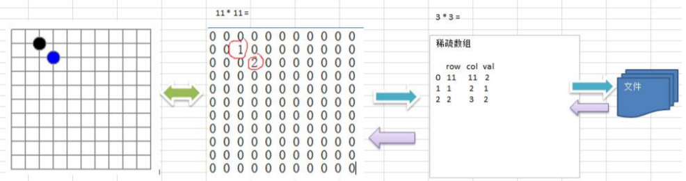
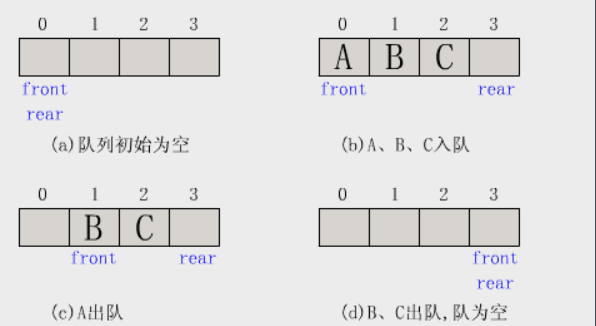
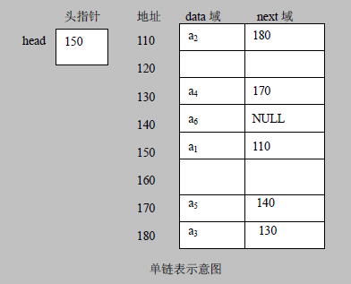
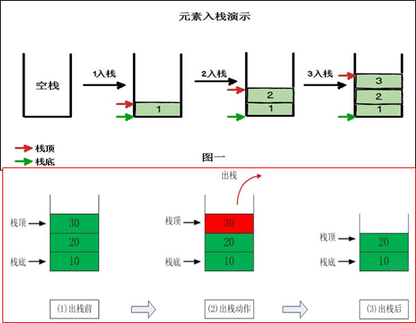
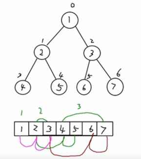
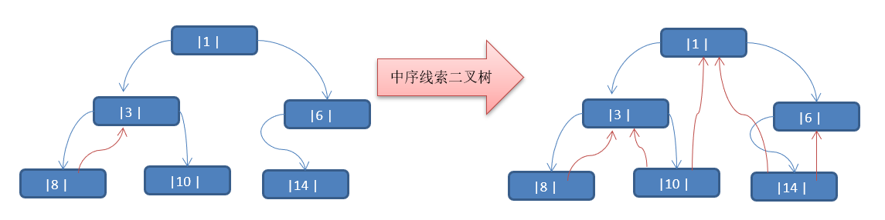

## 一、概述

### 1.1、基本概念

* 数据结构（data structure）是一门研究组织数据方式的学科。
* **程序 = 数据结构 + 算法**
* **数据结构是算法的基础**

### 1.2、分类

- __线性结构__：
  1. 线性结构作为常见数据结构，其特点是**数据元素之间存在一对一**的线性关系
  2. 线性结构有两种不同的存储结构，即**顺序存储（数组）和链式存储结构（链表）**。顺序存储的线性表称为顺序表，顺序存储中的**存储元素是连续**的
  3. 链式存储的线性表称为链表，链表中的**存储元素不一定是连续的**，元素节点中存放数据元素以及相邻元素的地址信息
  4. 线性结构常见的有：**数组、队列、链表、栈**
  5. 经典问题：**迷宫**，**八皇后**

- __非线性结构__：

  非线性结构包括：二维数组，多维数组，广义表，**树结构，图结构**

​	

## 二、线性结构

### 2.1、稀疏数组 SparseArray

* 适用场景: 存在大量无意义数据

* 处理方法：记录数组大小，有意义的值及其坐标

### 2.2、队列

1. 队列是一个**有序列表**，可以使用**数组**或是**链表**来实现
2. 遵循**先入先去**的原则

### 2.3、链表

  

1. 链表是以节点的方式来存储，是链式存储
2. 每个节点包含 data 域，next 域：指向下一个节点
3. 如图：发现链表的**各个节点不一定是连续存储**.

### 2.4、栈

1. 栈的英文为(stack)
2. 栈是一个**先入后出**(FILO-First In Last Out)的有序列表。
3. 栈(stack)是限制线性表中元素的插入和删除**只能在线性表的同一端**进行的一种特殊线性表。允许插入和删除的一端，为变化的一端，称为**栈顶**(Top)，另一端为固定的一端，称为**栈底**(Bottom)。

## 三、非线性结构

### 3.1、哈希表

### 3.2、树结构

**树**存储方式相较于数组和链表能提高数据**存储，读取**的效率

#### 二叉树

- 概念：

  1. 树有很多种，每个节点**最多只能有两个子节点**的一种形式称为二叉树

  2. 二叉树的子节点分为左节点和右节点

  3. 如果该二叉树的**所有叶子节点都在最后一层**，并且结点总数= 2^n-1 , n 为层数，则我们称为满二叉树

  4. 如果该二叉树的所有叶子节点都在最后一层或者倒数第二层，而且最后一层的叶子节点在左边连续，倒数第二层的叶子节点在右边连续，我们称为完全二叉树

     

- 遍历

  1. 前序遍历: **先输出父节点**，再遍历左子树和右子树

  2. 中序遍历: 先遍历左子树，**再输出父节点**，再遍历右子树

  3. 后序遍历: 先遍历左子树，再遍历右子树，**最后输出父节点**

     **小结**: 看输出父节点的位置

#### 顺序存储二叉树

* 特点

  1. 顺序二叉树通常只考虑完全二叉树
  2. 第n个元素的左子节点为  2 * n + 1 
  3. 第n个元素的右子节点为  2 * n + 2
  4. 第n个元素的父节点为  (n-1) / 2

  

#### 线索化二叉树

*   特点

  1. n个结点的二叉链表中含有n+1  【公式 2n-(n-1)=n+1】 个空指针域。利用二叉链表中的空指针域，存放指向**该**[结点](https://baike.baidu.com/item/结点)在**某种遍历次序**下的前驱和后继结点的指针（这种附加的指针称为"线索"）
  2. 这种加上了线索的二叉链表称为**线索链表**，相应的二叉树称为**线索二叉树(Threaded BinaryTree)**。根据线索性质的不同，线索二叉树可分为**前序线索二叉树、中序线索二叉树**和**后序线索二叉树**三种
  3. 一个结点的前一个结点，称为**前驱**结点
  4. 一个结点的后一个结点，称为**后继**结点

  

