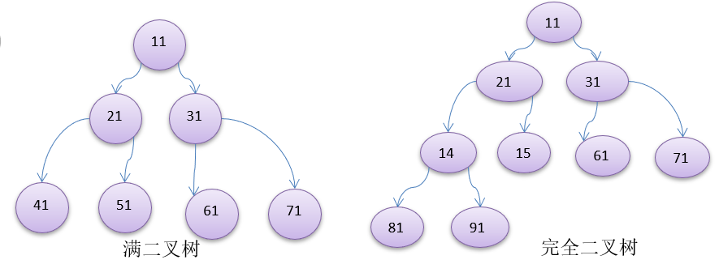

# 数据结构

### 1、数据结构和算法的关系

* 数据结构（data structure）是一门研究组织数据方式的学科。
* **程序 = 数据结构 + 算法**
* **数据结构是算法的基础**

### 2.1、线性结构

1. 线性结构作为常见数据结构，其特点是**数据元素之间存在一对一**的线性关系

2. 线性结构有两种不同的存储结构，即**顺序存储（数组）和链式存储结构（链表）**。顺序存储的线性表称为顺序表，顺序存储中的**存储元素是连续**的

3. 链式存储的线性表称为链表，链表中的**存储元素不一定是连续的**，元素节点中存放数据元素以及相邻元素的地址信息

4. 线性结构常见的有：**数组、队列、链表、栈**

### 2.2、非线性结构

​	非线性结构包括：二维数组，多维数组，广义表，**树结构，图结构**

### 3.1、稀疏数组 SparseArray

* 适用场景: 存在大量无意义数据

* 处理方法：记录数组大小，有意义的值及其坐标

### 3.2、队列

1. 队列是一个**有序列表**，可以使用**数组**或是**链表**来实现
2. 遵循**先入先去**的原则

### 4、链表

  

1. 链表是以节点的方式来存储，是链式存储
2. 每个节点包含 data 域，next 域：指向下一个节点
3. 如图：发现链表的**各个节点不一定是连续存储**.

### 5、栈

1. 栈的英文为(stack)

2. 栈是一个**先入后出**(FILO-First In Last Out)的有序列表。

3. 栈(stack)是限制线性表中元素的插入和删除**只能在线性表的同一端**进行的一种特殊线性表。允许插入和删除的一端，为变化的一端，称为**栈顶**(Top)，另一端为固定的一端，称为**栈底**(Bottom)。

