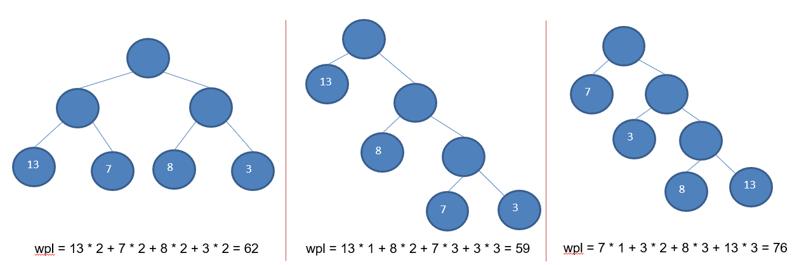
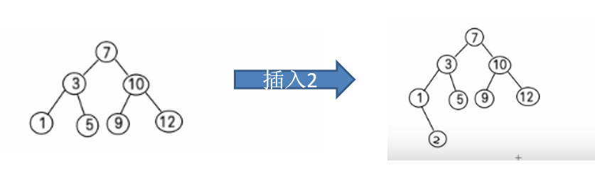
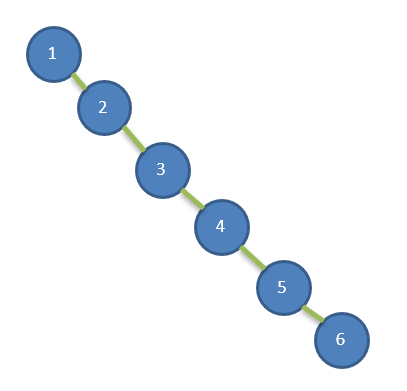
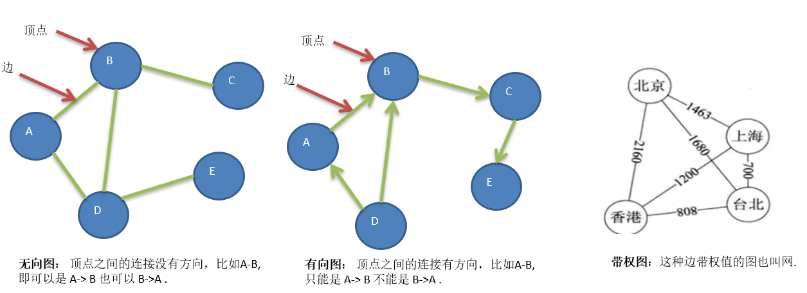
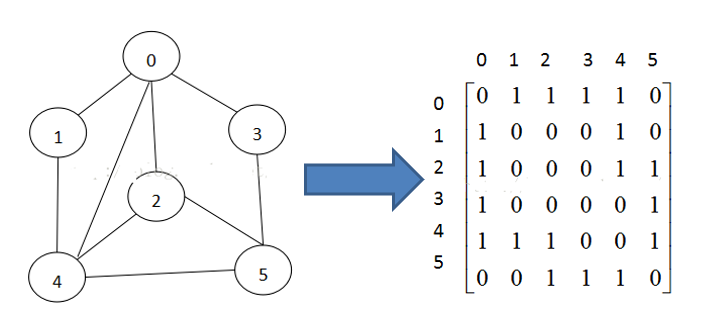
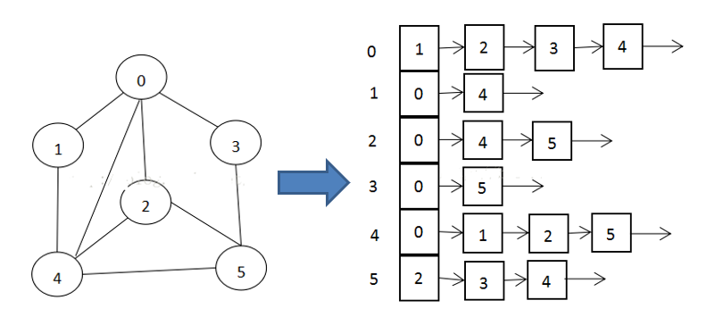

## 一、概述

### 1.1、基本概念

* 数据结构（data structure）是一门研究组织数据方式的学科。
* **程序 = 数据结构 + 算法**
* **数据结构是算法的基础**

### 1.2、分类

- __线性结构__：
  1. 线性结构作为常见数据结构，其特点是**数据元素之间存在一对一**的线性关系
  2. 线性结构有两种不同的存储结构，即**顺序存储（数组）和链式存储结构（链表）**。顺序存储的线性表称为顺序表，顺序存储中的**存储元素是连续**的
  3. 链式存储的线性表称为链表，链表中的**存储元素不一定是连续的**，元素节点中存放数据元素以及相邻元素的地址信息
  4. 线性结构常见的有：**数组、队列、链表、栈**
  5. 经典问题：**迷宫**，**八皇后**

- __非线性结构__：

  非线性结构包括：二维数组，多维数组，广义表，**树结构，图结构**

​	

## 二、线性结构

### 2.1、稀疏数组 SparseArray

* 适用场景: 存在大量无意义数据

* 处理方法：记录数组大小，有意义的值及其坐标

### 2.2、队列

1. 队列是一个**有序列表**，可以使用**数组**或是**链表**来实现
2. 遵循**先入先去**的原则

### 2.3、链表

  

1. 链表是以节点的方式来存储，是链式存储
2. 每个节点包含 data 域，next 域：指向下一个节点
3. 如图：发现链表的**各个节点不一定是连续存储**.

### 2.4、栈

1. 栈的英文为(stack)
2. 栈是一个**先入后出**(FILO-First In Last Out)的有序列表。
3. 栈(stack)是限制线性表中元素的插入和删除**只能在线性表的同一端**进行的一种特殊线性表。允许插入和删除的一端，为变化的一端，称为**栈顶**(Top)，另一端为固定的一端，称为**栈底**(Bottom)。

## 三、非线性结构

### 3.1、哈希表

### 3.2、树结构

**树**存储方式相较于数组和链表能提高数据**存储，读取**的效率

#### 二叉树

- 概念：

  1. 树有很多种，每个节点**最多只能有两个子节点**的一种形式称为二叉树

  2. 二叉树的子节点分为左节点和右节点

  3. 如果该二叉树的**所有叶子节点都在最后一层**，并且结点总数= 2^n-1 , n 为层数，则我们称为满二叉树

  4. 如果该二叉树的所有叶子节点都在最后一层或者倒数第二层，而且最后一层的叶子节点在左边连续，倒数第二层的叶子节点在右边连续，我们称为完全二叉树

     

- 遍历

  1. 前序遍历: **先输出父节点**，再遍历左子树和右子树

  2. 中序遍历: 先遍历左子树，**再输出父节点**，再遍历右子树

  3. 后序遍历: 先遍历左子树，再遍历右子树，**最后输出父节点**

     **小结**: 看输出父节点的位置

#### 顺序存储二叉树

* 特点

  1. 顺序二叉树通常只考虑完全二叉树
  2. 第n个元素的左子节点为  2 * n + 1 
  3. 第n个元素的右子节点为  2 * n + 2
  4. 第n个元素的父节点为  (n-1) / 2

  

#### 线索化二叉树

*   特点

  1. n个结点的二叉链表中含有n+1  【公式 2n-(n-1)=n+1】 个空指针域。利用二叉链表中的空指针域，存放指向**该结点**在**某种遍历次序**下的前驱和后继结点的指针（这种附加的指针称为"线索"）
  2. 这种加上了线索的二叉链表称为**线索链表**，相应的二叉树称为**线索二叉树(Threaded BinaryTree)**。根据线索性质的不同，线索二叉树可分为**前序线索二叉树、中序线索二叉树**和**后序线索二叉树**三种
  3. 一个结点的前一个结点，称为**前驱**结点
  4. 一个结点的后一个结点，称为**后继**结点

  

  #### 堆

* __特点__：

  1. 堆是一种特殊的完全二叉树
  2. 每个结点的值都大于或等于或小余其左右孩子结点的值
  3. 每个结点的值都__大于__或等于其左右孩子结点的值，称为__大顶堆__
  4. 每个结点的值都__小于__或等于其左右孩子结点的值，称为__小顶堆__

  __注意：__没有要求左右子节点的值的大小关系

#### 哈夫曼树

* **特点**：
  1. 给定N个权值作为N个[叶子结点](https://baike.baidu.com/item/叶子结点/3620239)，构造一棵二叉树，若该树的**带权路径（wpl）**长度达到最小，称这样的二叉树为最优二叉树，也称为哈夫曼树(Huffman Tree)
  2. 赫夫曼树是带权路径长度最短的树，权值较大的结点离根较近。

* **构建步骤**：
  1. 从小到大进行排序, 将每一个数据，每个数据都是一个节点 ， 每个节点可以看成是一颗最简单的二叉树
  2. 取出根节点权值最小的两颗二叉树 
  3. 组成一颗新的二叉树, 该新的二叉树的根节点的权值是前面两颗二叉树根节点权值的和  
  4. 再将这颗新的二叉树，以根节点的权值大小 再次排序， 不断重复  1-2-3-4 的步骤，直到数列中，所有的数据都被处理，就得到一颗赫夫曼树

#### 二叉排序树

* **特点**：

  1. BST: (Binary Sort(Search) Tree), 对于二叉排序树的任何一个非叶子节点，要求左子节点的值比当前节点的值小，右子节点的值比当前节点的值大。
  
2. **特别说明**：如果有相同的值，可以将该节点放在左子节点或右子节点
  
     
  
  3. 可能存在问题：给定一个数列{1,2,3,4,5,6}，左子树全部为空，从形式上看，更像一个单链表1)查询速度明显降低(因为需要依次比较), 不能发挥BST的优势，因为每次还需要比较左子树，其查询速度比单链表还慢
  
     
  

#### 平衡二叉树

* **基本介绍**：
  1. 平衡二叉树也叫平衡二叉搜索树（Self-balancing binary search tree）又被称为AVL树， 可以**保证查询效率较高**。
  2. 具有以下**特点**：它是一 棵空树或它的左右两个子树的高度差的绝对值不超过1，并且左右两个子树都是一棵平衡二叉树。平衡二叉树的常用实现方法有[红黑树](https://baike.baidu.com/item/红黑树/2413209)、[AVL](https://baike.baidu.com/item/AVL/7543015)、[替罪羊树](https://baike.baidu.com/item/替罪羊树/13859070)、[Treap](https://baike.baidu.com/item/Treap)、[伸展树](https://baike.baidu.com/item/伸展树/7003945)等。

### 3.3、图

* **需求背景**

  1. 线性表局限于一个直接前驱和一个直接后继的关系
  2. 树也只能有一个直接前驱也就是父节点
  3. 当我们需要表示多对多的关系时，这里我们就用到了图

* **基本介绍**

  1. 顶点(vertex)
  2. 边(edge)
  3. 路径
  4. 无向图
  5. 有向图
  6. 带权图

  

* **表示方式**

  1. **邻接矩阵**（二维数组）

     > 是表示图形中顶点之间相邻关系的矩阵，对于n个顶点的图而言，矩阵是的row和col表示的是1....n个点。

     

  2. **邻接表**

     > 邻接矩阵需要为每个顶点都分配n个边的空间，其实有很多边都是不存在,会造成空间的一定损失.

     > 邻接表的实现只关心存在的边，不关心不存在的边。因此没有空间浪费，邻接表由数组+链表组成

     

#### 图的遍历

