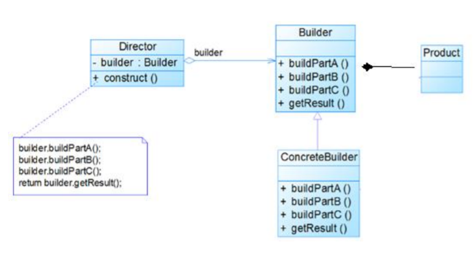

 

## 一、基本概念

### 1.1、简介

> __软件设计模式（Design pattern）__，又称设计模式，本质为提高软件的维护性，通用和扩展性，并降低软件的复杂度

### 1.2、原则

1. [开闭原则（ocp）](https://baike.baidu.com/item/%E8%BD%AF%E4%BB%B6%E8%AE%BE%E8%AE%A1%E6%A8%A1%E5%BC%8F/2117635?fromtitle=%E8%AE%BE%E8%AE%A1%E6%A8%A1%E5%BC%8F&fromid=1212549&fr=aladdin#5_1)，模块应该对扩展开放，对修改关闭
2. [里氏替换原则](https://baike.baidu.com/item/%E8%BD%AF%E4%BB%B6%E8%AE%BE%E8%AE%A1%E6%A8%A1%E5%BC%8F/2117635?fromtitle=%E8%AE%BE%E8%AE%A1%E6%A8%A1%E5%BC%8F&fromid=1212549&fr=aladdin#5_2 )，子类尽量不重写父类的方法，可通过聚合，组合，依赖等方式解决
3. [合成复用原则](https://baike.baidu.com/item/%E8%BD%AF%E4%BB%B6%E8%AE%BE%E8%AE%A1%E6%A8%A1%E5%BC%8F/2117635?fromtitle=%E8%AE%BE%E8%AE%A1%E6%A8%A1%E5%BC%8F&fromid=1212549&fr=aladdin#5_3 )，尽量使用合成 / 聚合的方式，而不是继承
4. [依赖倒转原则](https://baike.baidu.com/item/%E8%BD%AF%E4%BB%B6%E8%AE%BE%E8%AE%A1%E6%A8%A1%E5%BC%8F/2117635?fromtitle=%E8%AE%BE%E8%AE%A1%E6%A8%A1%E5%BC%8F&fromid=1212549&fr=aladdin#5_4 )，抽象不应依赖细节，细节应该依赖抽象
5. [接口隔离原则](https://baike.baidu.com/item/%E8%BD%AF%E4%BB%B6%E8%AE%BE%E8%AE%A1%E6%A8%A1%E5%BC%8F/2117635?fromtitle=%E8%AE%BE%E8%AE%A1%E6%A8%A1%E5%BC%8F&fromid=1212549&fr=aladdin#5_5 )，一个类对另一个类的依赖应该建立在最小的接口上
6. [抽象类](https://baike.baidu.com/item/%E8%BD%AF%E4%BB%B6%E8%AE%BE%E8%AE%A1%E6%A8%A1%E5%BC%8F/2117635?fromtitle=%E8%AE%BE%E8%AE%A1%E6%A8%A1%E5%BC%8F&fromid=1212549&fr=aladdin#5_6 )
8. 迪米特法则 ，避免类中出现**非直接朋友**（非成员变量，方法参数和返回值）关系的耦合

### 1.3、分类

1. **创建模式**：__[单例模式](https://baike.baidu.com/item/单例模式)__，__[抽象工厂模式](https://baike.baidu.com/item/抽象工厂模式)__ ,__原型模式__ ，__生成器模式__ ，__[工厂方法模式](https://baike.baidu.com/item/工厂方法模式)__

2. **结构模式**：__适配器模式__，__[桥接模式](https://baike.baidu.com/item/桥接模式)__，__修饰模式__ ，__[组合模式](https://baike.baidu.com/item/组合模式)__，__[外观模式](https://baike.baidu.com/item/外观模式)__，__享元模式__，__[代理模式](https://baike.baidu.com/item/代理模式)__
3. **行为模式**：__模板方法模式__，__命令模式__ ，__访问者模式 __，__迭代器模式__，__[观察者模式](https://baike.baidu.com/item/观察者模式)__，__中介者模式__，__备忘录模式__，__[解释器](https://baike.baidu.com/item/解释器)模式__，__状态模式__ ，__策略模式__，__责任链模式 __

## 二、创建模式

### 2.1、单例模式

> __[单例模式](https://baike.baidu.com/item/单例模式)__(Singleton)，保证一个类仅有一个实例，并提供一个访问它的全局访问点。

* **实现方式**
  1. **饿汉式-静态常量**：线程安全，类加载时创建，可能造成内存浪费
  
  2. **饿汉式-静态代码块**：线程安全，可能造成内存浪费
  
  3. **懒汉式-异步方法**：线程不安全
  
  4. **懒汉式-同步方法**：线程安全，效率低下
  
  5. **懒汉式-同步代码块**：线程安全，效率低下
  
  6. **双重检测**：线程安全，效率较高
  
  7. **静态内部类**：类加载机制保证线程安全，内部类实现懒加载，效率高
  
  8. **枚举**：线程安全，高效 且 能防止反序列化重新创建新的对象 

* **应用场景**

  需要频繁的进行创建和销毁的对象，重量级对象，经常用到的对象，工具类对象，如数据源，session工厂等

### 2.2、抽象工厂模式

> __[抽象工厂模式](https://baike.baidu.com/item/抽象工厂模式)__(Abstract Factory) ,提供一个创建一系列相关或相互依赖对象的接口，而无需指定它们具体的类。

### 2.3、原型模式

> __原型模式__ (Prototype) ，用原型实例指定创建对象的种类，并且通过拷贝这个原型来创建新的对象。

### 2.4、建造者模式

> __建造者模式__ (Builder)，将一个复杂对象的构建与它的表示分离，使得同样的构建过程可以创建不同的表示。

* **四个角色**：

  1. **Product（产品角色）**： 一个具体的产品对象。
  2. **Builder（抽象建造者）**： 创建一个Product对象的各个部件指定的 接口/抽象类。
  3. **ConcreteBuilder（具体建造者）**： 实现接口，构建和装配各个部件。
  4. **Director（指挥者）**： 构建一个使用Builder接口的对象。它主要是用于创建一个 复杂的对象。它主要有两个作用，一是：隔离了客户与对象的生产过程，二是： 负责控制产品对象的生产过程。 

  

### 2.5、工厂方法模式

> __[工厂方法模式](https://baike.baidu.com/item/工厂方法模式)__(Factory Method) ，定义一个用于创建对象的接口，让子类决定将哪一个类handlemodifed实例化。Factory Method使一个类的实例化延迟到其子类。

## 三、结构模式

### 3.1、适配器模式

> __适配器模式 __(Adapter) ，将一个类的接口转换成客户希望的另外一个接口。Adapter模式使得原本由于接口不兼容而不能一起工作的那些类可以一起工作。

### 3.2、桥接模式

> __[桥接模式](https://baike.baidu.com/item/桥接模式)__(Bridge) ，将抽象部分与它的实现部分分离，使它们都可以独立地变化。适用于多层继承，防止类爆炸

### 3.3、装饰模式

> __装饰模式__ (Decorator) ，动态地给一个对象添加一些额外的职责。就扩展功能而言， 它比生成子类方式更为灵活。

### 3.4、组合模式

> __[组合模式](https://baike.baidu.com/item/组合模式)__(Composite) ，将对象组合成树形结构以表示“部分-整体”的层次结构。它使得客户对单个对象和复合对象的使用具有一致性。

### 3.5、外观模式

> __[外观模式](https://baike.baidu.com/item/外观模式)__

### 3.6、享元模式

> __[工厂方法模式](https://baike.baidu.com/item/工厂方法模式)__(Factory Method) ，定义一个用于创建对象的接口，让子类决定将哪一个类实例化。Factory Method使一个类的实例化延迟到其子类。

### 3.7、代理模式

> __[代理模式](https://baike.baidu.com/item/代理模式)(Proxy)__ ，为其他对象提供一个代理以控制对这个对象的访问。

## 四、型为模式

### 4.1、模板方法模式

> 

### 4.2、命令模式

> __命令模式__ (Command) ，将一个请求封装为一个对象，从而使你可用不同的请求对客户进行参数化；对请求排队或记录请求日志，以及支持可取消的操作。

### 4.3、访问者模式

> __访问者模式 __(Visitor)，表示一个作用于某对象结构中的各元素的操作。它使你可以在不改变各元素的类的前提下定义作用于这些元素的新操作。

### 4.4、迭代器模式

> 

### 4.5、观察者模式

> __[观察者模式](https://baike.baidu.com/item/观察者模式)__(Observer) ，定义对象间的一种一对多的依赖关系,以便当一个对象的状态发生改变时,所有依赖于它的对象都得到通知并自动刷新。

### 4.6、中介模式

> 

### 4.7、备忘录模式

> __备忘录模式__ (Memento) ，在不破坏封装性的前提下，捕获一个对象的内部状态，并在该对象之外保存这个状态。这样以后就可将该对象恢复到保存的状态。

### 4.8、解释器模式

> 

### 4.9、状态模式

> __状态模式__ (State) ，允许一个对象在其内部状态改变时改变它的行为。对象看起来似乎修改了它所属的类。

### 4.10、策略模式

> __策略模式__ (Strategy) ，定义一系列的算法,把它们一个个封装起来, 并且使它们可相互替换。本模式使得算法的变化可独立于使用它的客户。

### 4.11、责任链模式

> __责任链模式 __(Chain of Responsibility) ，为解除请求的发送者和接收者之间耦合，而使多个对象都有机会处理这个请求。将这些对象连成一条链，并沿着这条链传递该请求，直到有一个对象处理它。

## 五、相关术语

### 5.1、UML类图

