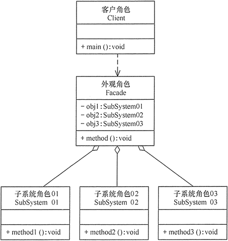

 

## 一、基本概念

### 1.1、简介

> __软件设计模式（Design pattern）__，又称设计模式，本质为提高软件的维护性，通用和扩展性，并降低软件的复杂度

### 1.2、原则

1. [开闭原则（ocp）](https://baike.baidu.com/item/%E8%BD%AF%E4%BB%B6%E8%AE%BE%E8%AE%A1%E6%A8%A1%E5%BC%8F/2117635?fromtitle=%E8%AE%BE%E8%AE%A1%E6%A8%A1%E5%BC%8F&fromid=1212549&fr=aladdin#5_1)，模块应该对扩展开放，对修改关闭
2. [里氏替换原则](https://baike.baidu.com/item/%E8%BD%AF%E4%BB%B6%E8%AE%BE%E8%AE%A1%E6%A8%A1%E5%BC%8F/2117635?fromtitle=%E8%AE%BE%E8%AE%A1%E6%A8%A1%E5%BC%8F&fromid=1212549&fr=aladdin#5_2 )，子类尽量不重写父类的方法，可通过聚合，组合，依赖等方式解决
3. [合成复用原则](https://baike.baidu.com/item/%E8%BD%AF%E4%BB%B6%E8%AE%BE%E8%AE%A1%E6%A8%A1%E5%BC%8F/2117635?fromtitle=%E8%AE%BE%E8%AE%A1%E6%A8%A1%E5%BC%8F&fromid=1212549&fr=aladdin#5_3 )，尽量使用合成 / 聚合的方式，而不是继承
4. [依赖倒转原则](https://baike.baidu.com/item/%E8%BD%AF%E4%BB%B6%E8%AE%BE%E8%AE%A1%E6%A8%A1%E5%BC%8F/2117635?fromtitle=%E8%AE%BE%E8%AE%A1%E6%A8%A1%E5%BC%8F&fromid=1212549&fr=aladdin#5_4 )，抽象不应依赖细节，细节应该依赖抽象
5. [接口隔离原则](https://baike.baidu.com/item/%E8%BD%AF%E4%BB%B6%E8%AE%BE%E8%AE%A1%E6%A8%A1%E5%BC%8F/2117635?fromtitle=%E8%AE%BE%E8%AE%A1%E6%A8%A1%E5%BC%8F&fromid=1212549&fr=aladdin#5_5 )，一个类对另一个类的依赖应该建立在最小的接口上
6. [抽象类](https://baike.baidu.com/item/%E8%BD%AF%E4%BB%B6%E8%AE%BE%E8%AE%A1%E6%A8%A1%E5%BC%8F/2117635?fromtitle=%E8%AE%BE%E8%AE%A1%E6%A8%A1%E5%BC%8F&fromid=1212549&fr=aladdin#5_6 )
8. 迪米特法则 ，避免类中出现**非直接朋友**（非成员变量，方法参数和返回值）关系的耦合

### 1.3、分类

1. **创建模式**：__[单例模式](https://baike.baidu.com/item/单例模式)__，__[抽象工厂模式](https://baike.baidu.com/item/抽象工厂模式)__ ,__原型模式__ ，__生成器模式__ ，__[工厂方法模式](https://baike.baidu.com/item/工厂方法模式)__

2. **结构模式**：__适配器模式__，__[桥接模式](https://baike.baidu.com/item/桥接模式)__，__修饰模式__ ，__[组合模式](https://baike.baidu.com/item/组合模式)__，__[外观模式](https://baike.baidu.com/item/外观模式)__，__享元模式__，__[代理模式](https://baike.baidu.com/item/代理模式)__
3. **行为模式**：__模板方法模式__，__命令模式__ ，__访问者模式 __，__迭代器模式__，__[观察者模式](https://baike.baidu.com/item/观察者模式)__，__中介者模式__，__备忘录模式__，__[解释器](https://baike.baidu.com/item/解释器)模式__，__状态模式__ ，__策略模式__，__责任链模式 __


## 二、创建模式

### 2.1、单例模式

> __[单例模式](https://baike.baidu.com/item/单例模式)__(Singleton)，保证一个类仅有一个实例，并提供一个访问它的全局访问点。

* **实现方式**
  1. **饿汉式-静态常量**：线程安全，类加载时创建，可能造成内存浪费
  
  2. **饿汉式-静态代码块**：线程安全，可能造成内存浪费
  
  3. **懒汉式-异步方法**：线程不安全
  
  4. **懒汉式-同步方法**：线程安全，效率低下
  
  5. **懒汉式-同步代码块**：线程安全，效率低下
  
  6. **双重检测**：线程安全，效率较高
  
  7. **静态内部类**：类加载机制保证线程安全，内部类实现懒加载，效率高
  
  8. **枚举**：线程安全，高效 且 能防止反序列化重新创建新的对象 

* **应用场景**

  需要频繁的进行创建和销毁的对象，重量级对象，经常用到的对象，工具类对象，如数据源，session工厂等


### 2.2、原型模式

> __原型模式__ (Prototype) ， 用一个已经创建的实例作为原型，通过复制该原型对象来创建一个和原型相同或相似的新对象 。

* **结构**：
  1. 抽象原型类：规定了具体原型对象必须实现的接口。
    2. 具体原型类：实现抽象原型类的 clone() 方法，它是可被复制的对象。
    3. 访问类：使用具体原型类中的 clone() 方法来复制新的对象。

  


### 2.3、工厂方法模式

> __[工厂方法模式](https://baike.baidu.com/item/工厂方法模式)__(Factory Method) ，定义一个用于创建对象的接口，让子类决定将哪一个类handlemodifed实例化。Factory Method使一个类的实例化延迟到其子类。

* **结构**：
  1. 抽象工厂（Abstract Factory）：提供了创建产品的接口，调用者通过它访问具体工厂的工厂方法 newProduct() 来创建产品。
    2. 具体工厂（ConcreteFactory）：主要是实现抽象工厂中的抽象方法，完成具体产品的创建。
    3. 抽象产品（Product）：定义了产品的规范，描述了产品的主要特性和功能。
    4. 具体产品（ConcreteProduct）：实现了抽象产品角色所定义的接口，由具体工厂来创建，它同具体工厂之间一一对应。

  

* **优点**：
  1. 用户只需要知道具体工厂的名称就可得到所要的产品，无须知道产品的具体创建过程；
  2. 在系统增加新的产品时只需要添加具体产品类和对应的具体工厂类，无须对原工厂进行任何修改，满足开闭原则；

* **缺点**： 每增加一个产品就要增加一个具体产品类和一个对应的具体工厂类，这增加了系统的复杂度。 


### 2.4、抽象工厂模式

> __[抽象工厂模式](https://baike.baidu.com/item/抽象工厂模式)__(Abstract Factory) ,提供一个创建一系列相关或相互依赖对象的接口，而无需指定它们具体的类。

* **结构**：

  1. 抽象工厂（Abstract Factory）：提供了创建产品的接口，它包含多个创建产品的方法 newProduct()，可以创建多个不同等级的产品。
  2. 具体工厂（Concrete Factory）：主要是实现抽象工厂中的多个抽象方法，完成具体产品的创建。
  3. 抽象产品（Product）：定义了产品的规范，描述了产品的主要特性和功能，抽象工厂模式有多个抽象产品。
  4. 具体产品（ConcreteProduct）：实现了抽象产品角色所定义的接口，由具体工厂来创建，它 同具体工厂之间是多对一的关系。

  

* **优点**：

  1. 可以在类的内部对产品族中相关联的多等级产品共同管理，而不必专门引入多个新的类来进行管理。
  2. 当增加一个新的产品族时不需要修改原代码，满足开闭原则。

* **缺点**： 当产品族中需要增加一个新的产品时，所有的工厂类都需要进行修改。 


### 2.5、建造者模式

> __建造者模式__ (Builder)，将一个复杂对象的构建与它的表示分离，使得同样的构建过程可以创建不同的表示。

* **结构**：

  1. **Product（产品角色）**： 一个具体的产品对象。
  2. **Builder（抽象建造者）**： 创建一个Product对象的各个部件指定的 接口/抽象类。
  3. **ConcreteBuilder（具体建造者）**： 实现接口，构建和装配各个部件。
  4. **Director（指挥者）**： 构建一个使用Builder接口的对象。它主要是用于创建一个 复杂的对象。它主要有两个作用，一是：隔离了客户与对象的生产过程，二是： 负责控制产品对象的生产过程。 

  

* **优点**：

  1. 各个具体的建造者相互独立，有利于系统的扩展。
  2. 客户端不必知道产品内部组成的细节，便于控制细节风险。

* **缺点**：

  1. 产品的组成部分必须相同，这限制了其使用范围。
  2. 如果产品的内部变化复杂，该模式会增加很多的建造者类。


## 三、结构模式

### 3.1、适配器模式

> __适配器模式 __(Adapter) ，将一个类的接口转换成客户希望的另外一个接口。Adapter模式使得原本由于接口不兼容而不能一起工作的那些类可以一起工作。 适配器模式分为类结构型模式和对象结构型模式两种，前者类之间的耦合度比后者高，且要求程序员了解现有组件库中的相关组件的内部结构，所以应用相对较少些。 

* **结构**：

  1. 目标（Target）接口：当前系统业务所期待的接口，它可以是抽象类或接口。
  2. 适配者（Adaptee）类：它是被访问和适配的现存组件库中的组件接口。
  3. 适配器（Adapter）类：它是一个转换器，通过继承或引用适配者的对象，把适配者接口转换成目标接口，让客户按目标接口的格式访问适配者。

  

  

* **优点**：
  1. 客户端通过适配器可以透明地调用目标接口。
  2. 复用了现存的类，程序员不需要修改原有代码而重用现有的适配者类。
  3. 将目标类和适配者类解耦，解决了目标类和适配者类接口不一致的问题。
* **缺点**： 对类适配器来说，更换适配器的实现过程比较复杂。 


### 3.2、桥接模式

> __[桥接模式](https://baike.baidu.com/item/桥接模式)__(Bridge) ，将抽象部分与它的实现部分分离，使它们都可以独立地变化。 它是用组合关系代替继承关系来实现，从而降低了抽象和实现这两个可变维度的耦合度。 

* **结构**：
  1. 抽象化（Abstraction）角色：定义抽象类，并包含一个对实现化对象的引用。
  2. 扩展抽象化（Refined  Abstraction）角色：是抽象化角色的子类，实现父类中的业务方法，并通过组合关系调用实现化角色中的业务方法。
  3. 实现化（Implementor）角色：定义实现化角色的接口，供扩展抽象化角色调用。
  4. 具体实现化（Concrete Implementor）角色：给出实现化角色接口的具体实现。  
* **优点**：
  1. 由于抽象与实现分离，所以扩展能力强；
  2. 其实现细节对客户透明。
* **缺点**： 由于聚合关系建立在抽象层，要求开发者针对抽象化进行设计与编程，这增加了系统的理解与设计难度。 


### 3.3、装饰模式

> __装饰模式__ (Decorator) ， 指在不改变现有对象结构的情况下，动态地给该对象增加一些职责（即增加其额外功能）的模式，它属于对象结构型模式。 

* **结构**：

  1. 抽象构件（Component）角色：定义一个抽象接口以规范准备接收附加责任的对象。
  2. 具体构件（Concrete  Component）角色：实现抽象构件，通过装饰角色为其添加一些职责。
  3. 抽象装饰（Decorator）角色：继承抽象构件，并包含具体构件的实例，可以通过其子类扩展具体构件的功能。
  4. 具体装饰（ConcreteDecorator）角色：实现抽象装饰的相关方法，并给具体构件对象添加附加的责任。

  

* **优点**：

  1. 采用装饰模式扩展对象的功能比采用继承方式更加灵活。
  2. 可以设计出多个不同的具体装饰类，创造出多个不同行为的组合。

* **缺点**： 装饰模式增加了许多子类，如果过度使用会使程序变得很复杂。


### 3.4、组合模式

> __[组合模式](https://baike.baidu.com/item/组合模式)__(Composite) ， 有时又叫作部分-整体模式，它是一种将对象组合成树状的层次结构的模式，用来表示“部分-整体”的关系，使用户对单个对象和组合对象具有一致的访问性。 

* **结构**：
  1. 抽象构件（Component）角色：它的主要作用是为树叶构件和树枝构件声明公共接口，并实现它们的默认行为。在透明式的组合模式中抽象构件还声明访问和管理子类的接口；在安全式的组合模式中不声明访问和管理子类的接口，管理工作由树枝构件完成。
    2. 树叶构件（Leaf）角色：是组合中的叶节点对象，它没有子节点，用于实现抽象构件角色中 声明的公共接口。
    3. 树枝构件（Composite）角色：是组合中的分支节点对象，它有子节点。它实现了抽象构件角色中声明的接口，它的主要作用是存储和管理子部件，通常包含 Add()、Remove()、GetChild() 等方法。

  

* **优点**：

  1. 组合模式使得客户端代码可以一致地处理单个对象和组合对象，无须关心自己处理的是单个对象，还是组合对象，这简化了客户端代码；
  2. 更容易在组合体内加入新的对象，客户端不会因为加入了新的对象而更改源代码，满足“开闭原则”；

* **缺点**：
  1. 设计较复杂，客户端需要花更多时间理清类之间的层次关系；
  2. 不容易限制容器中的构件；
  3. 不容易用继承的方法来增加构件的新功能；


### 3.5、外观模式

> __[外观模式](https://baike.baidu.com/item/外观模式)__ (Facade)， 是一种通过为多个复杂的子系统提供一个一致的接口，而使这些子系统更加容易被访问的模式。 

* **结构**：
  1. 外观（Facade）角色：为多个子系统对外提供一个共同的接口。
    2. 子系统（Sub System）角色：实现系统的部分功能，客户可以通过外观角色访问它。
    3. 客户（Client）角色：通过一个外观角色访问各个子系统的功能。

  

* **优点**：

  1. 降低了子系统与客户端之间的耦合度，使得子系统的变化不会影响调用它的客户类。
  2. 对客户屏蔽了子系统组件，减少了客户处理的对象数目，并使得子系统使用起来更加容易。
  3. 降低了大型软件系统中的编译依赖性，简化了系统在不同平台之间的移植过程，因为编译一个子系统不会影响其他的子系统，也不会影响外观对象。

* **缺点**：

  1. 不能很好地限制客户使用子系统类。
  2. 增加新的子系统可能需要修改外观类或客户端的源代码，违背了“开闭原则”。


### 3.6、享元模式

> 享元（Flyweight）模式的定义：运用共享技术来有効地支持大量细粒度对象的复用。它通过共享已经存在的对象来大幅度减少需要创建的对象数量、避免大量相似类的开销，从而提高系统资源的利用率。 

* **结构**：
  1. 抽象享元角色（Flyweight）:是所有的具体享元类的基类，为具体享元规范需要实现的公共接口，非享元的外部状态以参数的形式通过方法传入。
    2. 具体享元（Concrete Flyweight）角色：实现抽象享元角色中所规定的接口。
    3. 非享元（Unsharable Flyweight)角色：是不可以共享的外部状态，它以参数的形式注入具体享元的相关方法中。
    4. 享元工厂（Flyweight Factory）角色：负责创建和管理享元角色。当客户对象请求一个享元对象时，享元工厂检査系统中是否存在符合要求的享元对象，如果存在则提供给客户；如果不存在的话，则创建一个新的享元对象。

  

* **优点**： 相同对象只要保存一份，这降低了系统中对象的数量，从而降低了系统中细粒度对象给内存带来的压力。 

* **缺点**：

  1. 为了使对象可以共享，需要将一些不能共享的状态外部化，这将增加程序的复杂性。
  2. 读取享元模式的外部状态会使得运行时间稍微变长。


### 3.7、代理模式

> __[代理模式](https://baike.baidu.com/item/代理模式)(Proxy)__ ，为其他对象提供一个代理以控制对这个对象的访问。

* **结构**：
  
1. 抽象主题（Subject）类：通过接口或抽象类声明真实主题和代理对象实现的业务方法。
  2. 真实主题（Real Subject）类：实现了抽象主题中的具体业务，是代理对象所代表的真实对象，是最终要引用的对象。
  3. 代理（Proxy）类：提供了与真实主题相同的接口，其内部含有对真实主题的引用，它可以访问、控制或扩展真实主题的功能。
  
  
  
* **优点**：

  1. 代理模式在客户端与目标对象之间起到一个中介作用和保护目标对象的作用；
  2. 代理对象可以扩展目标对象的功能；
  3. 代理模式能将客户端与目标对象分离，在一定程度上降低了系统的耦合度；

* **缺点**：
  1. 在客户端和目标对象之间增加一个代理对象，会造成请求处理速度变慢；
  2. 增加了系统的复杂度；


## 四、行为模式

行为型模式用于描述程序在运行时复杂的流程控制，即描述多个类或对象之间怎样相互协作共同完成单个对象都无法单独完成的任务，它涉及算法与对象间职责的分配。

**行为型模式分为类行为模式和对象行为模式，前者采用继承机制来在类间分派行为，后者采用组合或聚合在对象间分配行为。**由于组合关系或聚合关系比继承关系耦合度低，满足“合成复用原则”，所以对象行为模式比类行为模式具有更大的灵活性。 

### 4.1、模板方法模式

> **模板方法（Template Method）**模式的定义如下：定义一个操作中的算法骨架，而将算法的一些步骤延迟到子类中，使得子类可以不改变该算法结构的情况下重定义该算法的某些特定步骤。它是一种类行为型模式。 

* **结构**：
  
1.  抽象类（Abstract Class）：负责给出一个算法的轮廓和骨架。它由一个模板方法和若干个基本方法构成。这些方法的定义如下。
     ① 模板方法：定义了算法的骨架，按某种顺序调用其包含的基本方法。
  
     ② 基本方法：是整个算法中的一个步骤，包含以下几种类型。 
  
     - 抽象方法：在抽象类中申明，由具体子类实现。
     - 具体方法：在抽象类中已经实现，在具体子类中可以继承或重写它。
     - 钩子方法：在抽象类中已经实现，包括用于判断的逻辑方法和需要子类重写的空方法两种。
  
  2. 具体子类（Concrete Class）：实现抽象类中所定义的抽象方法和钩子方法，它们是一个顶级逻辑的一个组成步骤。
  
  
  
* **优点**：

  1. 它封装了不变部分，扩展可变部分。它把认为是不变部分的算法封装到父类中实现，而把可变部分算法由子类继承实现，便于子类继续扩展。
  2. 它在父类中提取了公共的部分代码，便于代码复用。
  3. 部分方法是由子类实现的，因此子类可以通过扩展方式增加相应的功能，符合开闭原则。

* **缺点**：

  1. 对每个不同的实现都需要定义一个子类，这会导致类的个数增加，系统更加庞大，设计也更加抽象。
  2. 父类中的抽象方法由子类实现，子类执行的结果会影响父类的结果，这导致一种反向的控制结构，它提高了代码阅读的难度。


### 4.2、命令模式

> __命令模式__ (Command) ， 将一个请求封装为一个对象，使发出请求的责任和执行请求的责任分割开。这样两者之间通过命令对象进行沟通，这样方便将命令对象进行储存、传递、调用、增加与管理。 

* **结构**：
  
1. 抽象命令类（Command）角色：声明执行命令的接口，拥有执行命令的抽象方法 execute()。
  2. 具体命令角色（Concrete  Command）角色：是抽象命令类的具体实现类，它拥有接收者对象，并通过调用接收者的功能来完成命令要执行的操作。
  3. 实现者/接收者（Receiver）角色：执行命令功能的相关操作，是具体命令对象业务的真正实现者。
  4. 调用者/请求者（Invoker）角色：是请求的发送者，它通常拥有很多的命令对象，并通过访问命令对象来执行相关请求，它不直接访问接收者。
  
  
  
* **实现**：

  ```java
  packge command;
  public class CommandPattern {
      public static void main(String[] args) {
          Comand cmd = 
      }
  }
  ```

  

* **优点**：

  1. 降低系统的耦合度。命令模式能将调用操作的对象与实现该操作的对象解耦。
  2. 增加或删除命令非常方便。采用命令模式增加与删除命令不会影响其他类，它满足“开闭原则”，对扩展比较灵活。
  3. 可以实现宏命令。命令模式可以与[组合模式](http://c.biancheng.net/view/1373.html)结合，将多个命令装配成一个组合命令，即宏命令。
  4. 方便实现 Undo 和 Redo 操作。命令模式可以与后面介绍的[备忘录模式](http://c.biancheng.net/view/1400.html)结合，实现命令的撤销与恢复。

* **缺点**： 可能产生大量具体命令类。因为计对每一个具体操作都需要设计一个具体命令类，这将增加系统的复杂性。 


### 4.3、访问者模式

> __访问者模式 __(Visitor)，表示一个作用于某对象结构中的各元素的操作。它使你可以在不改变各元素的类的前提下定义作用于这些元素的新操作。

* **结构**：
  1. 

* **优点**：
* **缺点**：


### 4.4、迭代器模式

> 

* **结构**：
  1. 

* **优点**：
* **缺点**：


### 4.5、观察者模式

> __[观察者模式](https://baike.baidu.com/item/观察者模式)__(Observer) ，定义对象间的一种一对多的依赖关系,以便当一个对象的状态发生改变时,所有依赖于它的对象都得到通知并自动刷新。

* **结构**：
  1. 

* **优点**：
* **缺点**：


### 4.6、中介模式

> 


### 4.7、备忘录模式

> __备忘录模式__ (Memento) ，在不破坏封装性的前提下，捕获一个对象的内部状态，并在该对象之外保存这个状态。这样以后就可将该对象恢复到保存的状态。

* **结构**：
  1. 

* **优点**：
* **缺点**：


### 4.8、解释器模式

> 

* **结构**：
  1. 

* **优点**：
* **缺点**：


### 4.9、状态模式

> __状态模式__ (State) ，允许一个对象在其内部状态改变时改变它的行为。对象看起来似乎修改了它所属的类。

* **结构**：
  1. 

* **优点**：
* **缺点**：


### 4.10、策略模式

> __策略模式__ (Strategy) ，定义一系列的算法,把它们一个个封装起来, 并且使它们可相互替换。本模式使得算法的变化可独立于使用它的客户。

* **结构**：
  1. 

* **优点**：
* **缺点**：


### 4.11、责任链模式

> __责任链模式 __(Chain of Responsibility) ，为解除请求的发送者和接收者之间耦合，而使多个对象都有机会处理这个请求。将这些对象连成一条链，并沿着这条链传递该请求，直到有一个对象处理它。

* **结构**：
  1. 

* **优点**：
* **缺点**：


## 五、相关术语

### 5.1、UML类图


