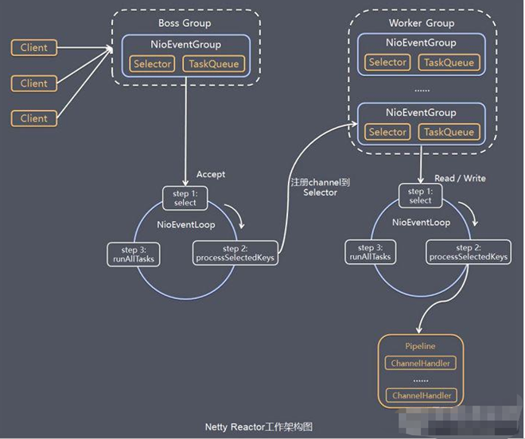
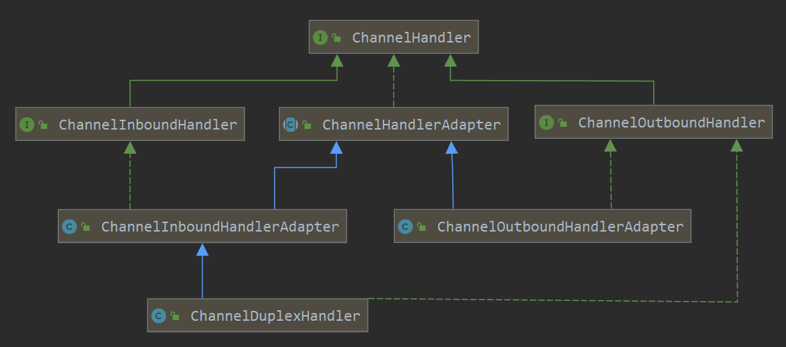
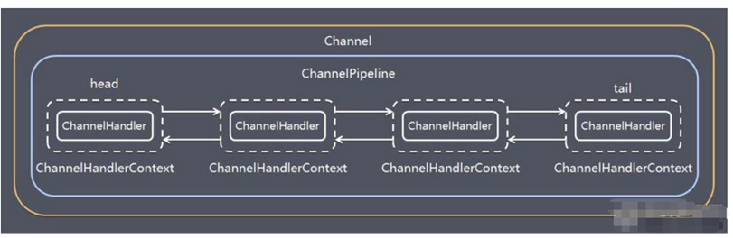

> Netty 是一个**异步基于事件驱动**的网络应用程序框架，用于快速开发可维护的高性能协议服务器和客户端。

## 一、网络模型

### BIO (blocking I/O)

> **同步并阻塞**。面向流，服务器实现为一个链接一个线程。

### NIO (non-blocking I/O)

> **同步非阻塞**。三大核心 **通道 (Channel)**、**缓冲区 (Buffer)**、**选择器 (Select)**，服务器实现为一个线程处理多个请求（连接）。即客户端发送的连接都会注册到多路复用器上，多路复用器轮询到连接有 I/O 请求就进行处理。**零拷贝**减少cpu拷贝，从而提高网络传输效率。

### AIO (Asynchronous I/O) 

> **异步非阻塞**。引入异步概念，采用了 Proactor 模式，简化了程序编写，有效的请求才启动线程。目前 linux 不支持，并未在netty中应用

 

## 二、Netty模型

## 三、核心模块组件

### ServerBootStrap

* 配置并引导 **服务端**  程序的启动

* 常见方法：

  | ServerBootstrap  group(EventLoopGroup parentGroup, EventLoopGroup childGroup) | 设置**连接组**，**工作组**  |
  | ------------------------------------------------------------ | --------------------------- |
  | B  channel(Class<? extends C> channelClass)                  | 设置通道实现                |
  | <T> B option(ChannelOption<T> option, T value)               | **连接组**的Channel参数配置 |
  | <T> ServerBootstrap childOption(ChannelOption<T> childOption, T value) | **工作组**的Channel参数配置 |
  | B handler(ChannelHandler handler)                            | 设置**连接组**业务处理类    |
  | ServerBootstrap  childHandler(ChannelHandler childHandler)   | 设置**工作组**业务处理类    |
  | ChannelFuture  bind(int inetPort)                            | 绑定端口                    |

### Bootstrap

* 配置并引导 **客户端**  程序的启动

* 常见方法：

  | B group(EventLoopGroup group)                        | 客户端设置工作组              |
  | ---------------------------------------------------- | ----------------------------- |
  | B channel(Class<? extends C> channelClass)           | 设置通道实现                  |
  | <T> B option(ChannelOption<T> option, T value)       | 用来给 ServerChannel 添加配置 |
  | B handler(ChannelHandler handler)                    | 设置业务处理                  |
  | ChannelFuture connect(String inetHost, int inetPort) | 用来连接服务器端              |

### ChannelFuture

* Netty 中所有的 IO 操作都是异步的，不能立刻得知消息是否被正确处理。但是可以过一会等它执行完成或者直接注册一个监听，具体的实现就是通过 Future 和 ChannelFutures

* 常用方法：

  | Channel channel()    | 返回当前正在进行 IO 操作的通道 |
  | -------------------- | ------------------------------ |
  | ChannelFuture sync() | 等待异步操作执行完毕           |

### Channel

* io.netty.channel.ChannelFuture

* Netty 网络通信的组件，作用于 **传输** 数据

* 不同协议，阻塞类型所对应的Channel类型：

  | NioSocketChannel       | 异步的客户端 TCP Socket 连接                                 |
  | ---------------------- | ------------------------------------------------------------ |
  | NioServerSocketChannel | 异步的服务器端 TCP Socket 连接                               |
  | NioDatagramChannel     | 异步的 UDP 连接                                              |
  | NioSctpChannel         | 异步的客户端 Sctp 连接                                       |
  | NioSctpServerChannel   | 异步的 Sctp 服务器端连接，这些通道涵盖了 UDP 和 TCP 网络 IO 以及文件 IO |

### ByteBuf

* io.netty.buffer.ByteBuf
* Netty 网络通信的组件，作用于 **存储** 数据

### Selector

* Netty 基于 Selector 对象实现 I/O 多路复用，通过 Selector 一个线程可以监听多个连接的 Channel 事件

### ChannelHandler 及其实现类

> ChannelHandler 是一个接口，处理 I/O 事件或拦截 I/O 操作，并将其转发到其 ChannelPipeline(业务处理链)中的下一个处理程序。

* ChannelInboundHandler 用于处理入站 I/O 事件。
* ChannelOutboundHandler 用于处理出站 I/O 操作。
* ChannelInboundHandlerAdapter 用于处理入站 I/O 事件。
* ChannelOutboundHandlerAdapter 用于处理出站 I/O 操作。
* ChannelDuplexHandler 用于处理入站和出站事件。

### ChannelPipeline

* ChannelPipeline 是一个 Handler 的集合，它负责处理和拦截 inbound 或者 outbound 的事件和操作，相当于一个贯穿 Netty 的链。(也可以这样理解：ChannelPipeline 是保存 ChannelHandler 的 List，用于处理或拦截 Channel 的入站事件和出站操作)

### ChannelHandlerContext

> 保存 Channel 相关的所有上下文信息，同时关联一个 ChannelHandler 对象

### Unpooled

> Netty 提供一个专门用来操作缓冲区(即Netty的数据容器)的工具类