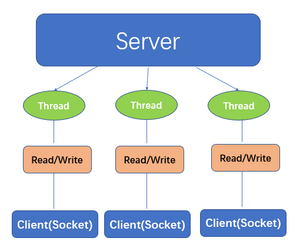
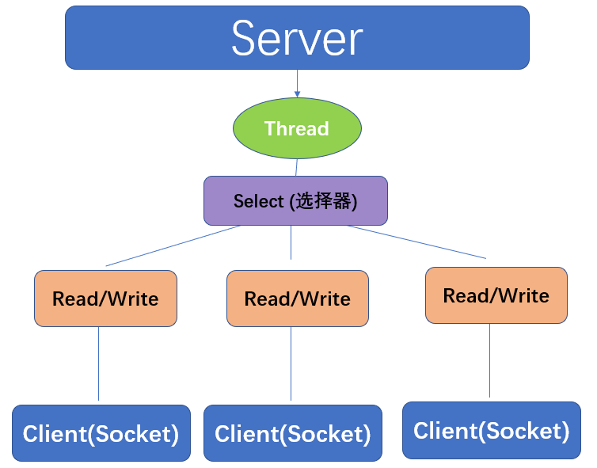

> Netty 是一个**异步基于事件驱动**的网络应用程序框架，用于快速开发可维护的高性能协议服务器和客户端。

## 一、网络模型

### BIO (blocking I/O)

> **同步并阻塞**。面向流，服务器实现为一个链接一个线程。

### NIO (non-blocking I/O)

> **同步非阻塞**。三大核心 **通道 (Channel)**、**缓冲区 (Buffer)**、**选择器 (Select)**，服务器实现为一个线程处理多个请求（连接）。即客户端发送的连接都会注册到多路复用器上，多路复用器轮询到连接有 I/O 请求就进行处理。**零拷贝**减少cpu拷贝，从而提高网络传输效率。

### AIO (Asynchronous I/O) 

> **异步非阻塞**。引入异步概念，采用了 Proactor 模式，简化了程序编写，有效的请求才启动线程。目前 linux 不支持，并未在netty中应用

 

## 二、Reactor 模型

### 单 Reactor 单线程

### 单 Reactor 多线程

### 多 Reactor 主从多线程

