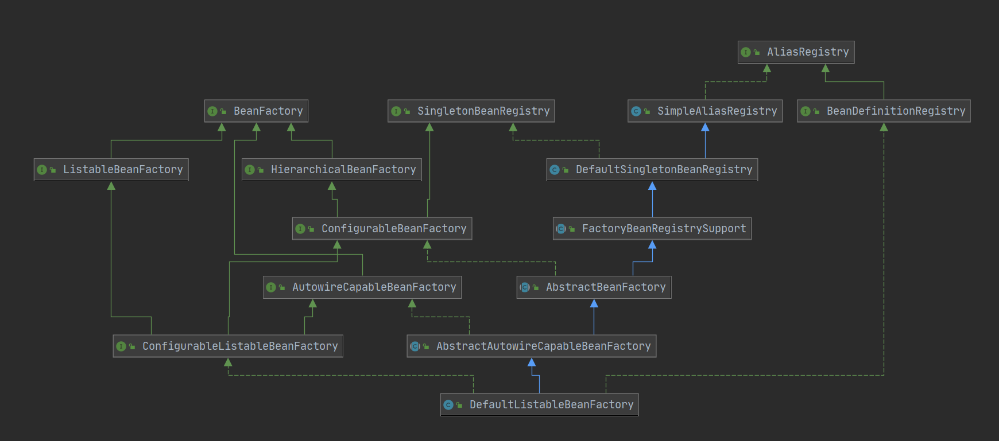
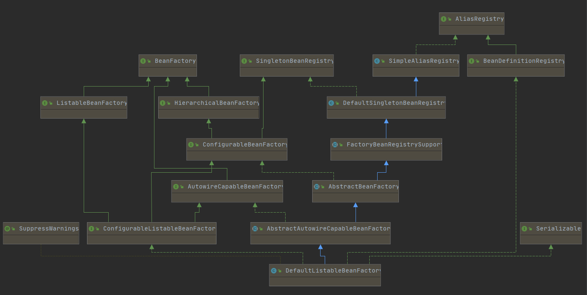

## 一、IOC（DI）

### 1.1 功能分析

ioc的前提的bean容器，获取容器的代码如下：

```java
BeanFactory bf = new XmlBeanFactory(new ClassPathResource("beanFactoryTest.xml"));
```

如同把大象放进冰箱一样，这段代码无非完成以下几点：

* 创建一个容器
* 读取配置文件 beanFactoryTest.xml。
* 根据 beanFactoryTest.xml 中的配置找到对应的类的配置，并实例化，然后放入容器。


### 1.2 核心类

#### 1.2.1 DefaultlistableBeanFactory

XmlBeanFactory 继承自 DefaultlistableBeanFactory，是整个 bean 加载的核心部分，是 Spring 注册及加载 bean 的默认实现。




#### 1.2.2 XmlBeanDefinitionReader

XmlBeanFactory 中聚合 XmlBeanDefinitionReader 为 reader 属性，使用该属性对资源文件读取和注册。




### 1.3 容器的基础 XmlBeanFactory


## 二、AOP

