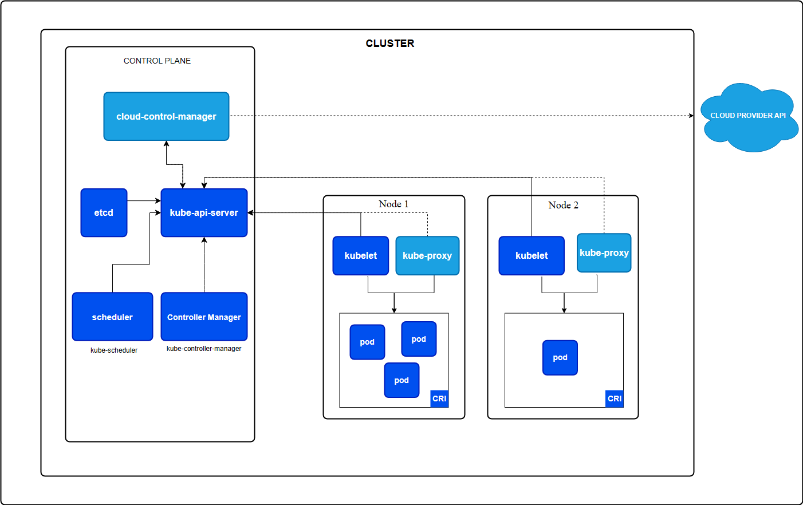

# 一、介绍

> Kubernetes 是一个可移植、可扩展的开源平台，用于管理容器化的工作负载和服务，方便进行声明式配置和自动化。Kubernetes 拥有一个庞大且快速增长的生态系统，其服务、支持和工具的使用范围广泛。

## 是什么

- **服务发现和负载均衡**

  Kubernetes 可以使用 DNS 名称或自己的 IP 地址来暴露容器。 如果进入容器的流量很大， Kubernetes 可以负载均衡并分配网络流量，从而使部署稳定。

- **存储编排**

  Kubernetes 允许你自动挂载你选择的存储系统，例如本地存储、公共云提供商等。

- **自动部署和回滚**

  你可以使用 Kubernetes 描述已部署容器的所需状态， 它可以以受控的速率将实际状态更改为期望状态。 例如，你可以自动化 Kubernetes 来为你的部署创建新容器， 删除现有容器并将它们的所有资源用于新容器。

- **自动完成装箱计算**

  你为 Kubernetes 提供许多节点组成的集群，在这个集群上运行容器化的任务。 你告诉 Kubernetes 每个容器需要多少 CPU 和内存 (RAM)。 Kubernetes 可以将这些容器按实际情况调度到你的节点上，以最佳方式利用你的资源。

- **自我修复**

  Kubernetes 将重新启动失败的容器、替换容器、杀死不响应用户定义的运行状况检查的容器， 并且在准备好服务之前不将其通告给客户端。

- **密钥与配置管理**

  Kubernetes 允许你存储和管理敏感信息，例如密码、OAuth 令牌和 SSH 密钥。 你可以在不重建容器镜像的情况下部署和更新密钥和应用程序配置，也无需在堆栈配置中暴露密钥。

- **批处理执行** 除了服务外，Kubernetes 还可以管理你的批处理和 CI（持续集成）工作负载，如有需要，可以替换失败的容器。
- **水平扩缩** 使用简单的命令、用户界面或根据 CPU 使用率自动对你的应用进行扩缩。
- **IPv4/IPv6 双栈** 为 Pod（容器组）和 Service（服务）分配 IPv4 和 IPv6 地址。
- **为可扩展性设计** 在不改变上游源代码的情况下为你的 Kubernetes 集群添加功能

## 不是什么

- **不限制支持的应用程序类型**。 Kubernetes 旨在支持极其多种多样的工作负载，包括无状态、有状态和数据处理工作负载。 如果应用程序可以在容器中运行，那么它应该可以在 Kubernetes 上很好地运行。
- **不部署源代码，也不构建你的应用程序**。 持续集成（CI）、交付和部署（CI/CD）工作流取决于组织的文化和偏好以及技术要求。
- **不提供应用程序级别的服务作为内置服务，例如中间件（例如消息中间件）、 数据处理框架（例如 Spark）、数据库（例如 MySQL）、缓存、集群存储系统 （例如 Ceph）**。这样的组件可以在 Kubernetes 上运行，并且/或者可以由运行在 Kubernetes 上的应用程序通过可移植机制（例如[开放服务代理](https://openservicebrokerapi.org/)）来访问。

- **不是日志记录、监视或警报的解决方案**。 它集成了一些功能作为概念证明，并提供了收集和导出指标的机制。
- **不提供也不要求配置用的语言、系统**（例如 jsonnet），它提供了声明性 API， 该声明性 API 可以由任意形式的声明性规范所构成。
- **不提供也不采用任何全面的机器配置、维护、管理或自我修复系统**。
- 此外，Kubernetes 不仅仅是一个编排系统，实际上它消除了编排的需要。 编排的技术定义是执行已定义的工作流程：首先执行 A，然后执行 B，再执行 C。 而 Kubernetes 包含了一组独立可组合的控制过程，可以持续地将当前状态驱动到所提供的预期状态。 你不需要在乎如何从 A 移动到 C，也不需要集中控制，这使得系统更易于使用且功能更强大、 系统更健壮，更为弹性和可扩展。

# 二、架构

## 控制平面（Control Plane）

控制平面（Control Plane）是指容器编排层，它由一些组件实现暴露 API 和接口来定义、 部署容器和管理容器的生命周期等功能。

### cloud-controller-manager

一个 Kubernetes [控制平面](https://kubernetes.io/zh-cn/docs/reference/glossary/?all=true#term-control-plane)组件， 嵌入了特定于云平台的控制逻辑。 [云控制器管理器（Cloud Controller Manager）](https://kubernetes.io/zh-cn/docs/concepts/architecture/cloud-controller/) 允许将你的集群连接到云提供商的 API 之上， 并将与该云平台交互的组件同与你的集群交互的组件分离开来。

### kube-api-server

API 服务器是 Kubernetes [控制平面](https://kubernetes.io/zh-cn/docs/reference/glossary/?all=true#term-control-plane)的组件， 该组件负责公开了 Kubernetes API，负责处理接受请求的工作。 API 服务器是 Kubernetes 控制平面的前端。

### etcd

一致且高可用的键值存储，用作 Kubernetes 所有集群数据的后台数据库。

### Controller Manager

[kube-controller-manager](https://kubernetes.io/zh-cn/docs/reference/command-line-tools-reference/kube-controller-manager/) 是[控制平面](https://kubernetes.io/zh-cn/docs/reference/glossary/?all=true#term-control-plane)的组件， 负责运行[控制器](https://kubernetes.io/zh-cn/docs/concepts/architecture/controller/)进程。

### scheduler

`kube-scheduler` 是[控制平面](https://kubernetes.io/zh-cn/docs/reference/glossary/?all=true#term-control-plane)的组件， 负责监视新创建的、未指定运行[节点（node）](https://kubernetes.io/zh-cn/docs/concepts/architecture/nodes/)的 [Pods](https://kubernetes.io/zh-cn/docs/concepts/workloads/pods/)， 并选择节点来让 Pod 在上面运行。

## 节点（Node）

Kubernetes 中的工作机器称作节点。可以是一个虚拟机或者物理机器，取决于所在的集群配置，这些节点由 **控制面** 负责管理，通常集群中会有若干个节点。节点包含Kubelet、kube-proxy、容器运行时（CRI）等组件。

### kubelet

`kubelet` 会在集群中每个[节点（node）](https://kubernetes.io/zh-cn/docs/concepts/architecture/nodes/)上运行。 它保证[容器（containers）](https://kubernetes.io/zh-cn/docs/concepts/overview/what-is-kubernetes/#why-containers)都运行在 [Pod](https://kubernetes.io/zh-cn/docs/concepts/workloads/pods/) 中

### kube-proxy

[kube-proxy](https://kubernetes.io/zh-cn/docs/reference/command-line-tools-reference/kube-proxy/) 是集群中每个[节点（node）](https://kubernetes.io/zh-cn/docs/concepts/architecture/nodes/)上所运行的网络代理， 实现 Kubernetes [服务（Service）](https://kubernetes.io/zh-cn/docs/concepts/services-networking/service/) 概念的一部分。

### CRI

这个基础组件使 Kubernetes 能够有效运行容器。 它负责管理 Kubernetes 环境中容器的执行和生命周期。

# 三、Pod

